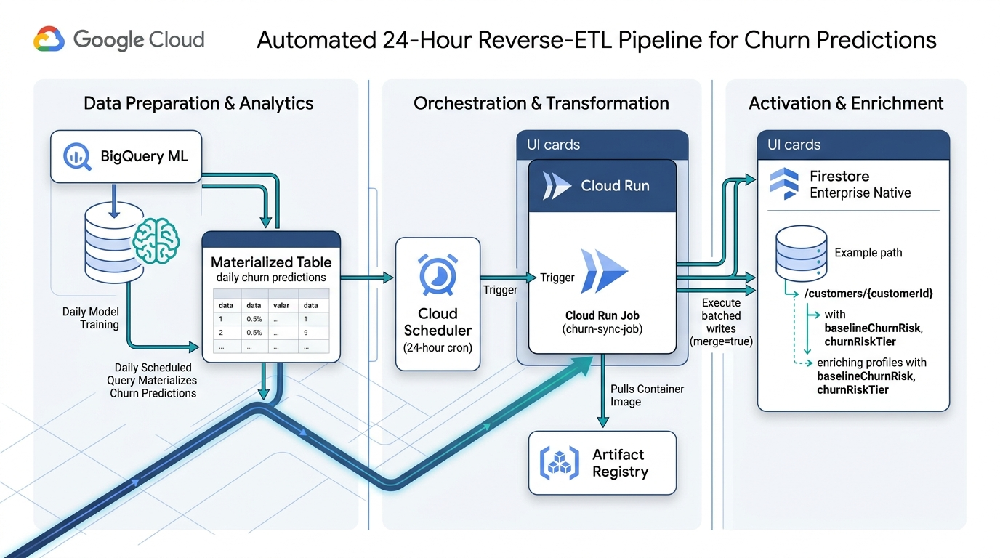

# Redwood Retail: Real-Time CDC from Firestore Enterprise Native to BigQuery via Cloud Dataflow

This project implements a production-ready Change Data Capture (CDC) streaming pipeline on Google Cloud. It synchronizes real-time change events from **Firestore Enterprise in Native Mode** into **BigQuery** using a managed **Google Cloud Dataflow** streaming pipeline.


> [!NOTE]
> For a detailed technical architecture deep dive, two-phase bootstrap documentation, Dataflow IAM delegation model, and troubleshooting steps, see the **[Architecture, Security & Operational Deployment Guide](docs/architecture_and_deployment_guide.md)**.

---

## 1. System Overview

* **Source Database**: Google Cloud Firestore Enterprise in Native Mode (`FIRESTORE_NATIVE`, Database ID: `redwood`, Region: `europe-west4`, Collection: `retail`).
* **Streaming Engine**: Google Cloud Dataflow streaming job (`DataflowRunner`) continuously ingesting document changes using native `google-cloud-firestore`.
* **Target Sink**: Google BigQuery dataset `redwood_retail` with a DAY-partitioned and multi-column clustered table `retail_cdc`.
* **Security & Authentication**: All applications and pipeline workers authenticate via Google Cloud Application Default Credentials (ADC) and IAM Service Accounts.

---

## 2. Prerequisites

Ensure you have the following installed and authenticated:

1. **Google Cloud SDK (`gcloud`)**:
   ```bash
   gcloud components update
   gcloud components install alpha
   gcloud auth login
   gcloud auth application-default login
   gcloud config set project elevate-cyvisser
   ```

2. **Terraform CLI** ($\ge$ 1.5.0):
   ```bash
   terraform -version
   ```

3. **Python 3.11+ Environment**:
   ```bash
   python3 -m venv .venv
   source .venv/bin/activate
   pip install "apache-beam[gcp]>=2.75.0" "google-cloud-firestore>=2.20.0" "google-cloud-bigquery>=3.25.0" "python-dotenv>=1.0.0"
   ```

4. **Environment Configuration (`.env`)**:
   Copy `.env.example` to `.env` and adjust the variables for your Google Cloud project and resources:
   ```bash
   cp .env.example .env
   ```
   All Python scripts, BigQuery SQL runners, and Dataflow pipelines automatically load configuration from `.env`.

---

## 3. Automated Deployment

You can deploy the entire end-to-end architecture (APIs, Firestore Enterprise Native database, VPC network, BigQuery dataset/table, Cloud Dataflow streaming pipeline, synthetic order seeding, and BigQuery ML models) by running:

```bash
./deploy.sh
```

### Deployment CLI Options:
* `./deploy.sh`: Runs full deployment, seeds 250 initial synthetic orders, and trains the BigQuery ML churn model.
* `./deploy.sh --create-project`: Bootstraps a fresh Google Cloud project using `terraform/bootstrap` before deploying components.
* `./deploy.sh --seed-count 1000`: Seeds 1,000 synthetic transaction documents into Firestore.
* `./deploy.sh --dry-run`: Runs Terraform plan and config verification without altering GCP resources.
* `./deploy.sh --skip-seed`: Deploys infrastructure without seeding sample orders.
* `./deploy.sh --skip-bqml`: Deploys infrastructure without training BigQuery ML models.
* `./deploy.sh --sync-churn`: Executes the Reverse-ETL sync pipeline locally, materializing BigQuery churn predictions into Firestore `/customers/{customerId}`.
* `./deploy.sh --sync-churn-dry-run`: Previews the Reverse-ETL sync execution without modifying Firestore documents.
* `./deploy.sh --build-sync-image`: Builds and pushes the Reverse-ETL sync container image to Artifact Registry via Cloud Build.
* `./deploy.sh --run-sync-job`: Triggers the Cloud Run Reverse-ETL sync job on demand via `gcloud`.
* `./deploy.sh --teardown` (or `./teardown.sh`): Cleanly destroys all infrastructure and drains Dataflow jobs.

#### Automated Provisioning Lifecycle:
1. **(Optional) Project Bootstrap**: Provisions a new Google Cloud project via `terraform/bootstrap`, attaches billing, enables base APIs, and populates `.env`.
2. **Prerequisites & .env Loading**: Maps `.env` variables automatically to Terraform (`TF_VAR_*`).
3. **API Enablement**: Enables `firestore`, `dataflow`, `compute`, `bigquery`, `storage`, `iam`.
4. **Firestore Enterprise Native Database**: Creates database `redwood` with Point-in-Time Recovery (PITR) and Firestore API Data Access enabled.
5. **VPC Networking**: Creates VPC `redwood-dataflow-net`, private subnet, Cloud Router, and Cloud NAT.
6. **IAM Service Account**: Configures `dataflow-redwood-sa` with required Datastore, Dataflow, and BigQuery roles.
7. **BigQuery Target**: Provisions dataset `redwood_retail` and CDC table `retail_cdc`.
8. **Cloud Dataflow Pipeline**: Submits the streaming pipeline using `DataflowRunner`.
9. **Data Seeding & CDC Replicate**: Seeds synthetic e-commerce orders into Firestore via native `WriteBatch`.
10. **BigQuery ML Training**: Builds the feature view and trains the Logistic Regression churn prediction model.

### Creating a New Project (Altostrat / Sandbox):
To provision a brand new project before deploying components:
```bash
# 1. Configure bootstrap variables with your billing account
cp terraform/bootstrap/terraform.tfvars.example terraform/bootstrap/terraform.tfvars

# 2. Run deploy with project bootstrap flag
./deploy.sh --create-project
```
See [`terraform/bootstrap/README.md`](terraform/bootstrap/README.md) for full details on standalone bootstrap execution.

---

## 4. Verification & Monitoring

### 1. Verify Firestore Enterprise Native Database
```bash
gcloud alpha firestore databases describe --database="$FIRESTORE_DATABASE_ID" --project="$GCP_PROJECT_ID" \
  --format="table(name,databaseEdition,type,firestoreDataAccessMode,realtimeUpdatesMode)"
```

### 2. Verify Cloud Dataflow Streaming Job
```bash
gcloud dataflow jobs list --region="$GCP_REGION" --project="$GCP_PROJECT_ID" --status=active
```
*Console URL*: Open [https://console.cloud.google.com/dataflow/jobs](https://console.cloud.google.com/dataflow/jobs) to view the real-time execution graph, worker autoscaling, and throughput metrics.

### 3. Verify BigQuery CDC Table Schema
```bash
bq show "$GCP_PROJECT_ID:$BIGQUERY_DATASET.$BIGQUERY_CDC_TABLE"
```

### 4. Verify BigQuery Scheduled Query (Automated Daily Churn Analysis)

You can verify that the BigQuery Scheduled Query is created and active via the `bq` CLI or Cloud Console:

#### A. Retrieve the Scheduled Query `$CONFIG_ID`

To inspect or trigger transfer runs, you need the resource identifier (`$CONFIG_ID`). You can retrieve it using any of the following methods:

* **Option 1: From Terraform Output (Recommended / Fastest)**
  ```bash
  CONFIG_ID=$(terraform -chdir=terraform output -raw bigquery_scheduled_query_name)
  echo "CONFIG_ID: $CONFIG_ID"
  ```

* **Option 2: Using `bq` CLI with `jq` Filter**
  ```bash
  CONFIG_ID=$(bq ls --transfer_config --transfer_location="$GCP_REGION" --project_id="$GCP_PROJECT_ID" --format=json | \
    jq -r '.[] | select(.displayName | test("Daily Redwood Customer Churn")) | .name')
  echo "CONFIG_ID: $CONFIG_ID"
  ```

* **Option 3: Using `bq` CLI with Python (No `jq` dependency)**
  ```bash
  CONFIG_ID=$(python3 -c "
  import subprocess, json, os
  region = os.environ.get('GCP_REGION', 'asia-southeast1')
  project = os.environ.get('GCP_PROJECT_ID', '')
  out = subprocess.check_output(['bq', 'ls', '--transfer_config', f'--transfer_location={region}', f'--project_id={project}', '--format=json'])
  for c in json.loads(out):
      if 'Daily Redwood' in c.get('displayName', ''):
          print(c['name'])
          break
  ")
  echo "CONFIG_ID: $CONFIG_ID"
  ```

*Example Format*: `projects/379924935547/locations/asia-southeast1/transferConfigs/6a99bdac-0000-2740-83bb-582429c61734`

---

#### B. Inspect Transfer Configuration Details
View the scheduled query configuration, state, schedule expression, and target service account:
```bash
bq show --transfer_config "$CONFIG_ID"
```

---

#### C. Trigger a Test Run On-Demand
You can manually trigger an immediate execution of the scheduled query to verify without waiting 24 hours:
```bash
# Trigger an immediate run (using a 1-day schedule window)
bq mk --transfer_run \
  --start_time="$(date -u -d '1 day ago' +"%Y-%m-%dT00:00:00Z")" \
  --end_time="$(date -u +"%Y-%m-%dT00:00:00Z")" \
  "$CONFIG_ID"

# List run history and execution states
bq ls --transfer_run --transfer_location="$GCP_REGION" "$CONFIG_ID"
```

---

#### D. Verify Persisted Predictions in BigQuery
Confirm that the scheduled query successfully populated the `customer_churn_predictions` table:
```bash
# Check table metadata
bq show "$GCP_PROJECT_ID:$BIGQUERY_DATASET.customer_churn_predictions"

# Query top at-risk customers
bq query --use_legacy_sql=false \
  "SELECT customer_id, customer_name, churn_probability, automated_retention_action, prediction_timestamp \
   FROM \`$GCP_PROJECT_ID.$BIGQUERY_DATASET.customer_churn_predictions\` \
   ORDER BY churn_probability DESC LIMIT 5;"
```

*Console URL*: Open [https://console.cloud.google.com/bigquery/scheduled-queries](https://console.cloud.google.com/bigquery/scheduled-queries) to view interactive run logs, schedule health, and execution history.

---

## 5. Testing Real-Time Replication

### A. Generate Batch Retail Orders
Execute [`generate_retail_dataset.py`](file:///usr/local/google/home/jicong/work/firestore-redwood/generate_retail_dataset.py) to write synthetic e-commerce orders into Firestore Native:
```bash
python3 generate_retail_dataset.py --count 100 --workers 4
```

### B. Query Replicated CDC Records in BigQuery
Run a query against BigQuery to confirm events were streamed in real time:
```sql
SELECT 
  order_id, 
  operation_type, 
  customer_name, 
  order_status, 
  payment_status, 
  grand_total, 
  currency, 
  change_timestamp,
  JSON_VALUE(document_data, "$.paymentMethod") AS payment_method
FROM `driven-rig-474510-s8.redwood.orders_cdc`
ORDER BY change_timestamp DESC
LIMIT 10;
```

---

## 6. BigQuery ML Customer Churn Prediction & Analytics

The file [`bigquery_churn_sentiment_analysis.sql`](file:///usr/local/google/home/jicong/work/firestore-redwood/bigquery_churn_sentiment_analysis.sql) implements an end-to-end Machine Learning pipeline directly inside Google BigQuery using **BigQuery ML (`logistic_reg`)**. It creates:
1. **Feature Engineering View** (`customer_historical_data`): Aggregates orders, returns, support sentiment, and engagement metrics.
2. **Churn Classification Model** (`customer_churn_model`): Logistic Regression with automated class weighting and L2 regularization.
3. **Persisted Predictions Table** (`customer_churn_predictions`): Stores churn probabilities and action-oriented retention recommendations.
4. **Automated Daily Scheduled Query**: Automatically updates predictions every 24 hours.

### Running BigQuery ML Pipeline with `.env`:
```bash
# 1. Preview / Dry-run rendered SQL statements with .env parameters:
python3 run_bigquery_analysis.py --dry-run

# 2. Execute all views, models, and predictions against BigQuery:
python3 run_bigquery_analysis.py --execute
```

### Verifying Churn Prediction Results in BigQuery:

After the ML pipeline or scheduled query runs, use these queries to verify that the predictions are written and populated in the BigQuery table:

#### 1. Confirm Table Existence & Record Count
Verify that the `customer_churn_predictions` table exists and contains records for all replicated customers:
```bash
bq query --use_legacy_sql=false \
  "SELECT 
     COUNT(*) AS total_predicted_customers,
     COUNTIF(churn_probability >= 0.50) AS high_risk_customers,
     ROUND(AVG(churn_probability), 4) AS average_churn_probability
   FROM \`$GCP_PROJECT_ID.$BIGQUERY_DATASET.$BIGQUERY_PREDICTIONS_TABLE\`;"
```

#### 2. Check Retention Action Tier Breakdown
Confirm that customers are segmented across automated retention action tiers:
```bash
bq query --use_legacy_sql=false \
  "SELECT 
     automated_retention_action, 
     COUNT(*) AS customer_count, 
     ROUND(AVG(churn_probability), 3) AS avg_churn_prob,
     ROUND(SUM(total_spend_90d), 2) AS total_revenue_at_stake
   FROM \`$GCP_PROJECT_ID.$BIGQUERY_DATASET.$BIGQUERY_PREDICTIONS_TABLE\`
   GROUP BY automated_retention_action
   ORDER BY avg_churn_prob DESC;"
```

#### 3. Inspect Top At-Risk Customer Records
Verify that individual customer records include churn probabilities, sentiment scores, and behavioral features:
```bash
bq query --use_legacy_sql=false \
  "SELECT 
     customer_id, 
     customer_name, 
     customer_segment, 
     loyalty_tier, 
     churn_probability, 
     automated_retention_action, 
     total_spend_90d, 
     days_since_last_purchase, 
     cart_abandonment_count, 
     sentiment_score, 
     prediction_timestamp
   FROM \`$GCP_PROJECT_ID.$BIGQUERY_DATASET.$BIGQUERY_PREDICTIONS_TABLE\`
   ORDER BY churn_probability DESC, total_spend_90d DESC
   LIMIT 10;"
```

#### 4. Verify Prediction Freshness Timestamp
Confirm that `prediction_timestamp` reflects the latest inference execution:
```bash
bq query --use_legacy_sql=false \
  "SELECT 
     MIN(prediction_timestamp) AS earliest_prediction,
     MAX(prediction_timestamp) AS latest_prediction
   FROM \`$GCP_PROJECT_ID.$BIGQUERY_DATASET.$BIGQUERY_PREDICTIONS_TABLE\`;"
```

*Console Direct Query*: You can also run these queries directly in [BigQuery Studio](https://console.cloud.google.com/bigquery).

---

## 5. Automated 24-Hour Reverse-ETL: BigQuery to Firestore Churn Sync

To close the loop between daily BigQuery batch ML analytics and real-time operational applications, Redwood Retail includes an automated, serverless **Reverse-ETL pipeline**. 



> [!NOTE]
> For the complete technical specification, containerization guide, and operational runbook, see the **[Automated 24-Hour Reverse-ETL Cloud Run Guide](docs/reverse_etl_cloud_run_guide.md)**.

### Architecture Highlights:
1. **Containerized Cloud Run Job (`churn-sync-job`)**:
   * Packaged via `Dockerfile` and executes `sync_churn_to_firestore.py` to completion without web server overhead.
   * Chunks writes into 500-document batches (Firestore atomic batch ceiling) and commits concurrently via a bounded thread pool.
   * Enforces `merge=True` to preserve real-time customer state without field loss.
2. **Cloud Scheduler (`daily-churn-sync-scheduler`)**:
   * Triggers the Cloud Run Job via OAuth 2.0 on a recurring 24-hour schedule (`0 3 * * *` UTC), 1 hour after daily BigQuery churn modeling completes.
3. **Dedicated Artifact Registry Repository (`pipeline-images`)**:
   * Stores versioned Docker images built via Cloud Build.

### Reverse-ETL CLI Commands:
```bash
# 1. Preview sync execution plan without writing to Firestore
./deploy.sh --sync-churn-dry-run

# 2. Run Reverse-ETL sync locally with active ADC
./deploy.sh --sync-churn

# 3. Build & push container image to Artifact Registry
./deploy.sh --build-sync-image

# 4. Trigger Cloud Run Job on-demand in Google Cloud
./deploy.sh --run-sync-job
```

---

## 7. Teardown & Cleanup

To destroy all cloud resources, stop billing, and drain Dataflow streaming pipelines:

```bash
./teardown.sh
```

---

## 8. Security & Authentication Architecture

* **Zero-Secret Design**: No usernames, passwords, or credentials stored on disk.
* **IAM & Application Default Credentials (ADC)**: All Python applications and Beam worker VMs authenticate with native Google Cloud IAM.
* **Private Worker Isolation**: Dataflow worker VMs run with private IP addresses (`--no_use_public_ips`) inside `redwood-dataflow-subnet` and route external requests through Cloud NAT.
