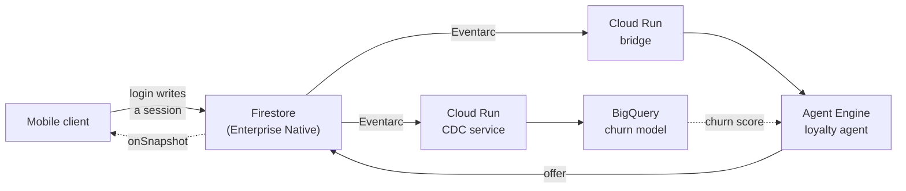

# Redwood Retail

A demonstration of an autonomous retention loop on Google Cloud.

A customer logs in. Within seconds they either receive a personalised loyalty
offer or they do not, depending on a churn score BigQuery computed from their
own order history. No part of the path is polled or scheduled; the login itself
causes the decision.


```mermaid
flowchart LR
  M["Mobile client"] -->|"login writes<br/>a session"| FS["Firestore<br/>(Enterprise Native)"]
  FS -->|Eventarc| CDC["Cloud Run<br/>CDC service"]
  CDC --> BQ["BigQuery<br/>churn model"]
  FS -->|Eventarc| BR["Cloud Run<br/>bridge"]
  BR --> AG["Agent Engine<br/>loyalty agent"]
  BQ -.->|churn score| AG
  AG -->|"offer"| FS
  FS -.->|onSnapshot| M
```

## Documentation

| Document | Contents |
|---|---|
| [docs/architecture.md](docs/architecture.md) | What runs, how it fits together, and why each choice was made |
| [docs/demo_flow.md](docs/demo_flow.md) | Deploying, running the demo, and troubleshooting |
| [COLLABORATION.md](COLLABORATION.md) | Git workflow |
| [mobile_client/README.md](mobile_client/README.md) | The mobile client |

## Quick start

```bash
cp .env.example .env        # set GCP_PROJECT_ID and GCP_REGION
gcloud auth application-default login
./deploy.sh
./deploy.sh --verify-demo   # write a live session and check the agent reacts
```

`deploy.sh` provisions its own virtual environment. See
[docs/demo_flow.md](docs/demo_flow.md) for the flags that let you skip the
expensive steps on a re-run.

## Layout

```
cdc_service/     Firestore change events to BigQuery, Cloud Run
agent_bridge/    Eventarc CloudEvent to Agent Engine call, Cloud Run
loyalty_agent/   The retention agent, deployed to Agent Engine
terraform/       All infrastructure except the agent itself
scripts/         Agent deployment and live demo verification
mobile_client/   React frontend and FastAPI backend
docs/            Architecture and demo documentation

bigquery_churn_sentiment_analysis.sql   Feature views, model, scoring
customer_profiles.py, order_factory.py  Synthetic customer and order generation
generate_retail_dataset.py              Seeder entry point
run_bigquery_analysis.py                Runs the churn SQL
deploy.sh, teardown.sh                  Lifecycle
```

## Status

The backend is deployed and verified end to end. The mobile client is not yet
wired to the session flow; until it is, sessions are written by
`scripts/verify_demo_flow.py`.
