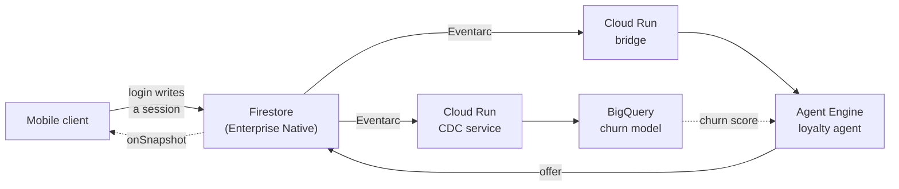

# Redwood Retail

A demonstration of an autonomous retention loop on Google Cloud.

A customer logs in. Within seconds they either receive a personalised loyalty
offer or they do not, depending on a churn score BigQuery computed from their
own order history. No part of the path is polled or scheduled; the login itself
causes the decision.


```mermaid
flowchart LR
  M["Mobile client"] -->|"login writes<br/>a session"| FS["Firestore<br/>(Enterprise Native)"]
  FS -->|Eventarc| CDC["Cloud Run<br/>CDC service"]
  CDC --> BQ["BigQuery<br/>churn model"]
  FS -->|Eventarc| BR["Cloud Run<br/>bridge"]
  BR --> AG["Agent Engine<br/>loyalty agent"]
  BQ -.->|churn score| AG
  AG -->|"offer"| FS
  FS -.->|onSnapshot| M
```

## Documentation

| Document | Contents |
|---|---|
| [docs/architecture.md](docs/architecture.md) | What runs, how it fits together, and why each choice was made |
| [docs/demo_flow.md](docs/demo_flow.md) | Deploying, running the demo, and troubleshooting |
| [COLLABORATION.md](COLLABORATION.md) | Git workflow |
| [mobile_client/README.md](mobile_client/README.md) | The mobile client |

## Quick start

```bash
cp .env.example .env        # set GCP_PROJECT_ID and GCP_REGION
gcloud auth application-default login
./deploy.sh
./deploy.sh --verify-demo   # write a live session and check the agent reacts
```

`deploy.sh` provisions its own virtual environment. See
[docs/demo_flow.md](docs/demo_flow.md) for the flags that let you skip the
expensive steps on a re-run.

## Layout

```
cdc_service/     Firestore change events to BigQuery, Cloud Run
agent_bridge/    Eventarc CloudEvent to Agent Engine call, Cloud Run
churn_service/   The churn pipeline, Cloud Run function
loyalty_agent/   The retention agent, deployed to Agent Engine
terraform/       All infrastructure except the agent itself
scripts/         Agent deployment and live demo verification
mobile_client/   React frontend and FastAPI backend, Cloud Run
docs/            Architecture and demo documentation

bigquery_churn_sentiment_analysis.sql   Feature views, model, scoring
customer_profiles.py, order_factory.py  Synthetic customer and order generation
generate_retail_dataset.py              Seeder entry point
deploy.sh, teardown.sh                  Lifecycle
```

## Status

The loop is closed and verified end to end against the live project. The mobile
client writes the login session itself and watches the outcome over SSE, and
the price the customer pays comes from the offer the agent issued: there is no
tier discount anywhere in the system, so `demo1` pays list price and `demo2`
pays whatever its offer says. The Redwood Console runs beside the phone on
`/console` for the operator's view, and its **Reset Demo** button restores
the seeded dataset and warms the agent in about three seconds.
`scripts/verify_demo_flow.py` still writes sessions directly, which is how the
pipeline is checked without a browser.

Everything the demo does at runtime runs in the cloud. The app and console are
one Cloud Run service (`redwood-app`) and the churn pipeline is another
(`redwood-churn`); the console's **Recalculate Churn** button calls the latter
over HTTP and streams its log back into the Event Log. Neither service is
public — both are `roles/run.invoker` only — so `deploy.sh` finishes by opening
a local proxy and printing the URLs to open:

```bash
python3 scripts/run_proxy.py --url "${APP_URL}" --port 8080
# Mobile app:      http://localhost:8080
# Redwood Console: http://localhost:8080/console
```

For frontend work there is still a local mode, which builds the frontend and
runs the backend against the same deployed churn function:

```bash
./mobile_client/start_mobile_app.sh          # phone on :5174, console on :5174/console.html
ENABLE_DEMO_CONTROLS=0 ./mobile_client/start_mobile_app.sh   # without the operator controls
```

