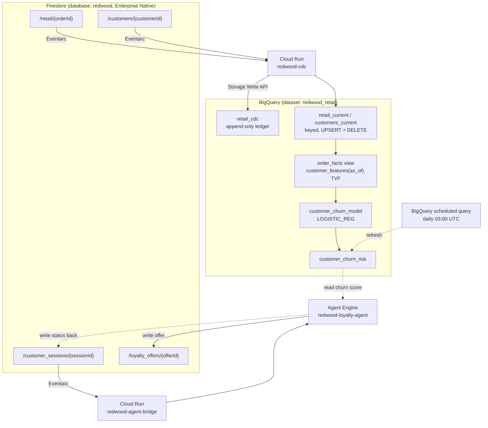
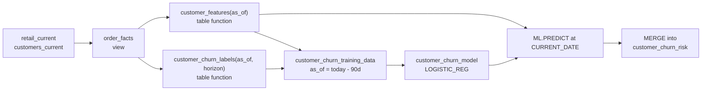
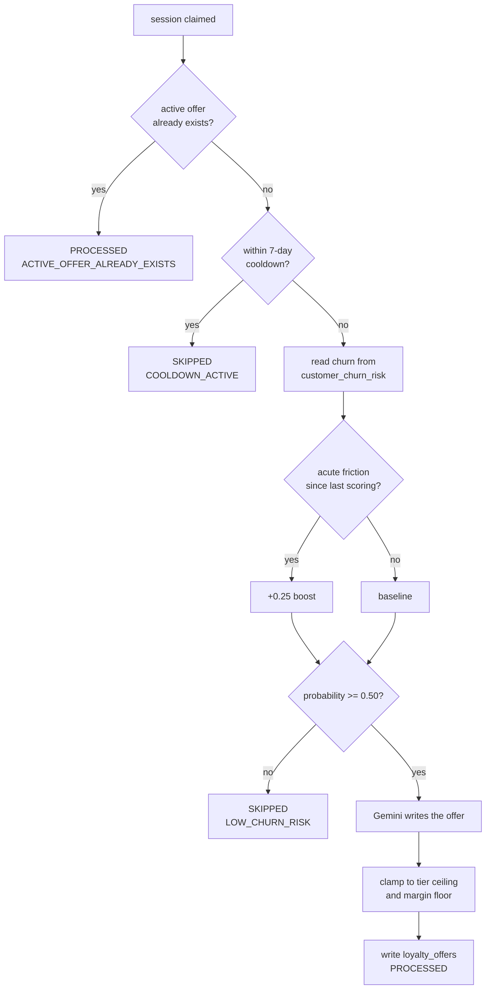

# Redwood Retail: Architecture

Redwood Retail is a demonstration of an autonomous retention loop on Google
Cloud. A customer logs in, and within seconds either receives a personalised
loyalty offer or does not, depending on a churn score that BigQuery computed
from that customer's own order history. Nothing in the path is scheduled or
polled; every step is driven by a database write.

This document describes what runs, how the pieces fit, and why each choice was
made. For how to deploy it and run the demo, see [demo_flow.md](demo_flow.md).

---

## 1. The system at a glance



Two independent event paths share one database:

- **Replication.** Order and customer writes reach BigQuery in seconds.
- **Retention.** A session write causes the agent to make a decision.

They are deliberately separate. A failure in replication degrades the freshness
of the churn scores but does not stop the agent from answering a login, and a
failure in the agent does not stop data reaching the warehouse.

---

## 2. Firestore

Database `redwood`, Firestore **Enterprise edition in Native mode**, with
point-in-time recovery enabled.

| Collection | Written by | Purpose |
|---|---|---|
| `retail` | seeder, mobile client | Orders, one document per order |
| `customers` | seeder, mobile client | Customer profile and rollups |
| `customer_sessions` | mobile client | One document per login |
| `loyalty_offers` | the agent | Issued offers |

`customer_sessions` and `loyalty_offers` carry TTL policies (30 and 90 days) so
demo runs do not accumulate indefinitely.

### Indexes

Four composite indexes are declared in
[firestore_indexes.tf](../terraform/firestore_indexes.tf). One of them is worth
calling out, because its absence caused a silent total failure:

```
loyalty_offers: (customerId ASC, createdAt DESC)
```

The agent's cooldown check filters on `customerId`, ranges on `createdAt` and
orders by `createdAt DESC`. An index of `(customerId, status, createdAt)`
already existed, but **Firestore matches composite indexes by field prefix**,
so an index with `status` wedged between the two fields in use cannot serve
that query. The query raised, and the agent treats a failed cooldown lookup as
*in cooldown*. The result was that no customer could ever receive an offer, and
nothing was logged. Both indexes are now declared.

---

## 3. Replication: Firestore to BigQuery

Implemented by [cdc_service/](../cdc_service), deployed to Cloud Run as
`redwood-cdc` and driven by two Eventarc triggers, one per collection.

### Why not Dataflow

The original design used a Dataflow streaming job. It was removed. A Dataflow
job cannot tail Firestore directly, so it needed a Pub/Sub hop in front of it
to receive the change events, which meant paying for a permanently running
worker pool to do work that amounts to reshaping a document into a row. Cloud
Run does the same job, scales to zero, and receives the change event directly
from Eventarc. The Dataflow path was also not true CDC: it re-read documents
rather than consuming the change stream, so a delete was invisible to it and
left a stale row in BigQuery.

### Eventarc constraints worth knowing

These are not obvious and each one cost time to discover:

- `event_data_content_type` is **required**, and only `application/protobuf` is
  accepted for Firestore sources. `application/json` is rejected at trigger
  creation with a field violation.
- Delivery is **at-least-once and unordered**. Every keyed table therefore
  carries `_CHANGE_SEQUENCE_NUMBER`, so a late-arriving older event cannot
  overwrite a newer one.
- Named (non-default) Firestore databases only support Cloud Run and 2nd-gen
  Cloud Functions as trigger destinations.
- Both the `eventarc` and `firestore` service identities must already exist and
  the Eventarc agent must hold `roles/eventarc.serviceAgent`. If they do not,
  trigger creation fails with a message naming neither of them.
- One trigger per collection. There is no multi-collection matcher.
- **Firestore emits no change event when a write leaves a document
  byte-identical.** The seeder is deterministic, so re-running it without
  `--drop-existing` produces thousands of no-op writes and zero events. This is
  why `deploy.sh` reconciles BigQuery unconditionally rather than only when the
  table looks empty.

### Table shapes

| Table | Shape | Why |
|---|---|---|
| `retail_cdc` | Append-only ledger | Keeps the full change history, including supersedes and deletes |
| `retail_current` | `PRIMARY KEY (order_id) NOT ENFORCED` | Current state, UPSERT and DELETE applied |
| `customers_current` | `PRIMARY KEY (customer_id) NOT ENFORCED` | Same, for customers |

The declared primary key is what enables the Storage Write API's CDC mode; the
UPSERT and DELETE operations are rejected without it.

Rows are written with the **BigQuery Storage Write API**. The Python client has
no `JsonStreamWriter` (that is Java only), so the service builds a **proto2**
descriptor at runtime from the table schema. proto2 is required rather than
proto3 because proto3 cannot distinguish a field that was never set from one
explicitly set to `0.0` or `""`, and that distinction is the difference between
"this customer has no recorded complaint" and "this customer complained about
nothing".

### Backfill

[cdc_service/backfill.py](../cdc_service/backfill.py) walks the collections and
pushes every document through the same writer the event path uses, so a
reconciliation cannot drift from live replication. It is idempotent: a second
pass upserts rather than duplicating. Measured at roughly 138 documents per
second.

---

## 4. Churn modelling

All of it is SQL, in
[bigquery_churn_sentiment_analysis.sql](../bigquery_churn_sentiment_analysis.sql).
There is no Python in the scoring path; the model is trained, evaluated and
applied inside BigQuery.



### Avoiding leakage

Features are produced by a **table function taking an `as_of` date**, not a
fixed query. Called with a historical date it yields only what was knowable
then; called with `CURRENT_DATE()` it yields the live vector. Training and
inference therefore execute identical code, which removes the usual source of
train/serve skew.

The training cutoff is 90 days ago with a 90-day label horizon, so the horizon
has actually elapsed. Scoring against a horizon still in progress would label
active customers as churned purely because the clock had not run out.
`orders_in_horizon` is explicitly dropped from the feature set, since it counts
the very purchases the label is defined on.

The model uses `auto_class_weights = TRUE`. Without it, a model on a 29 percent
base rate can score well by predicting "will not churn" for everyone, which is
precisely the customer the system exists to catch.

### Reading the evaluation

Evaluation is persisted to `customer_churn_model_evaluation` rather than left
in job history, so a regression is visible. Current figures:

```
precision 0.7742   recall 0.8571   accuracy 0.8625
log_loss  0.3422   roc_auc 0.9106
```

An AUC near 1.0 on this problem would be evidence of leakage, not of a good
model. 0.91 against a 29 percent base rate is the expected shape.

### Keeping the score table honest

The final step is a `MERGE` into `customer_churn_risk` including a
`WHEN NOT MATCHED BY SOURCE THEN DELETE` clause. Without it the table only ever
grew: it once held 650 rows against 402 live customers, 250 of them scored from
documents that had since been deleted.

Two customers are legitimately unscored. `cust_retail_000004` and
`cust_retail_000351` have only CANCELLED orders, which `order_facts` excludes.
400 scored out of 402 is correct.

### Daily refresh

A **BigQuery scheduled query** re-runs the whole file every day at 03:00 UTC,
declared in [churn_schedule.tf](../terraform/churn_schedule.tf) and running as
the pipeline service account. A scheduled query was chosen over Cloud Scheduler
plus a job runner because the work is a SQL script and BigQuery can run SQL
scripts on a schedule without any intermediate service to operate.

> [!NOTE]
> `gcloud beta bq transfer-configs` is not available in current gcloud. Inspect
> the schedule through the REST API at
> `https://bigquerydatatransfer.googleapis.com/v1/{config}`.

---

## 5. The retention agent

One agent, in [loyalty_agent/](../loyalty_agent), deployed to **Vertex AI Agent
Engine** under the display name `redwood-loyalty-agent`.

### Why one agent

An earlier design had six agents (orchestrator, cooldown, churn, friction,
synthesis, fulfilment) talking over A2A. Every one of them was a deterministic
rule except synthesis, which writes the offer copy. The mesh added five network
hops, five failure modes and roughly 600 lines of Terraform to express a
sequence of `if` statements. It was collapsed into a single agent that calls
Gemini once, for the only part that actually needs a model.

### Decision sequence



### Thresholds

All in [config.py](../loyalty_agent/config.py), none hardcoded elsewhere.

| Setting | Value |
|---|---|
| Offer threshold | 0.50 |
| Critical threshold | 0.75 |
| Tiers | LOW < 0.25 ≤ MODERATE < 0.50 ≤ HIGH < 0.75 ≤ CRITICAL |
| Acute friction boost | +0.25 |
| Cooldown | 7 days |
| Offer validity | 14 days |
| Discount ceilings | ENTERPRISE_VIP 25%, RETAIL_PRO 20%, STANDARD_LOYALTY 15%, CASUAL 12% |
| Margin floor | 10% |

The friction boost exists because the batch model scores overnight. A complaint
raised this morning is invisible to it, and the boost is what lets the agent
react to today's grievance rather than yesterday's snapshot.

The discount Gemini proposes is always clamped to the tier ceiling and checked
against the margin floor. The model influences the wording and the size within
bounds; it cannot set the bounds.

### Why Agent Engine rather than a container

`LoyaltyAgentEngine` in [main.py](../loyalty_agent/main.py) already implements
the runtime contract (`set_up()`, `query()`, `register_operations()`), so the
object is handed to the SDK directly. A container would mean writing and
maintaining an HTTP server whose only job is to call `query()`.

Deployment is [scripts/deploy_agent_engine.py](../scripts/deploy_agent_engine.py).
Three things about it are load-bearing:

- `extra_packages` must be a **relative** path. The SDK uploads paths with
  their directory structure intact, so an absolute path buries the package too
  deep to import.
- The environment must be passed explicitly. The agent builds its config at
  import time and refuses to guess a project, and the Agent Engine runtime has
  no `.env`. When this is missing the API reports only `failed to start and
  cannot serve traffic`, with the real cause visible solely in Cloud Logging.
- The engine runs as the **pipeline service account**. The Agent Engine default
  identity can serve traffic but holds no Firestore or BigQuery access, so the
  agent would deploy cleanly and fail on its first real session.

---

## 6. The bridge

[agent_bridge/](../agent_bridge), Cloud Run service `redwood-agent-bridge`.

Agent Engine cannot be an Eventarc destination, so something must receive the
CloudEvent and turn it into an agent call. The bridge is that and nothing else;
all retention logic lives in the agent. It reuses the CDC service's event
decoder rather than carrying a second protojson implementation that could
disagree with the first, which is why its Docker build context is the
repository root.

Three design points:

**Resolution by display name, not id.** The predecessor to this file carried a
reasoning engine id as a Terraform default. It pointed at a resource in a
different project and went stale the moment the agent was redeployed. Nothing
now records an engine id; the bridge lists engines and matches on display name,
caching the handle for the process lifetime behind a lock. Resolution happens
on first request rather than at import, because a lookup failure at import
would hide behind a startup probe timeout.

**The loop guard.** The agent writes its result back to the session document,
which raises another change event. The bridge forwards only sessions whose
`agentProcessingStatus` is still `PENDING`, so the write-back is delivered and
ignored.

**Failure handling is asymmetric on purpose.** An unparseable event returns 200,
because retrying will never help. An agent failure returns 500 so Eventarc
retries, which is safe because the agent claims a session before working on it
and ignores one already claimed. Deduplication lives in the agent only; a
second opinion about what counts as a duplicate is a second thing that can
disagree.

---

## 7. Infrastructure

Everything except the agent itself is Terraform in [terraform/](../terraform).

| File | Contents |
|---|---|
| `firestore.tf`, `firestore_indexes.tf`, `security_rules.tf` | Database, indexes, TTLs, rules |
| `bigquery.tf` | Dataset and CDC tables |
| `cdc_service.tf` | CDC Cloud Run service and its two triggers |
| `agent_bridge.tf` | Bridge service and the session trigger |
| `churn_schedule.tf` | Daily scheduled query |
| `iam.tf`, `services.tf` | Service accounts, identities, API enablement |
| `storage.tf`, `artifact_registry.tf` | Staging bucket, image repository |
| `bootstrap/` | Optional project creation, separate state |

### Image digests, not tags

Both services are deployed by **digest**, never by `:latest`. A mutable tag is
the same string to Terraform before and after a rebuild, so the plan comes out
empty and the new image never rolls out. This already happened once: the CDC
service served stale code while `latest` had moved, and every event failed to
parse. `deploy.sh` resolves each tag to a digest and exports it as
`TF_VAR_cdc_image_digest` / `TF_VAR_agent_bridge_image_digest`.

### The service account name

`PIPELINE_SERVICE_ACCOUNT` still has the value `dataflow-redwood-sa`. Renaming
it would cause Terraform to destroy and recreate the account, dropping every
IAM grant attached to it. The variable was renamed; the value deliberately was
not.

> [!WARNING]
> `terraform plan` and `terraform apply` hang silently when a variable is
> missing, because they are waiting on an interactive prompt. Always pass
> `-input=false` and export the full `TF_VAR_*` set, which is what `deploy.sh`
> does.

---

## 8. Known rough edges

- `GET /healthz` on both Cloud Run services returns a Google frontend 404 when
  called externally, while Cloud Run's own startup probe against the same path
  succeeds and the services work. Unexplained, not blocking, not worth further
  time.
- `gcloud auth print-identity-token --audiences=...` fails for user credentials
  with "Invalid account type". Tooling that needs to call these services
  directly has to work around it.
- `gcloud alpha ai reasoning-engines list` does not exist. Use the REST API or
  the Python SDK.
- `mobile_client/tests/test_schema_parity.py` no longer imports. It calls
  `generate_single_order`, which the seeder rewrite replaced with
  `order_factory.build_order`. The mobile client is deferred, and the test will
  be repaired as part of that work.
