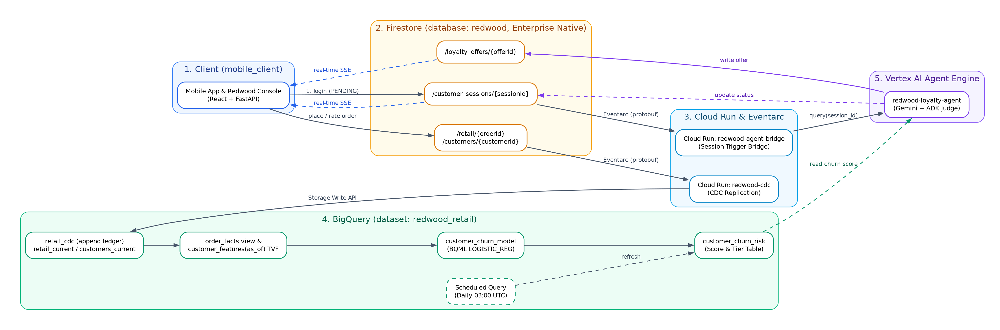
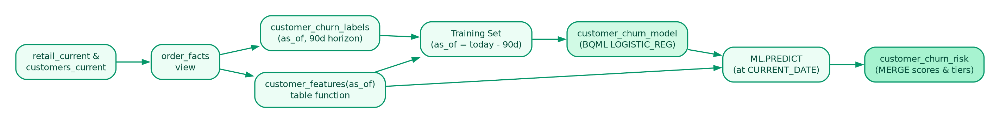
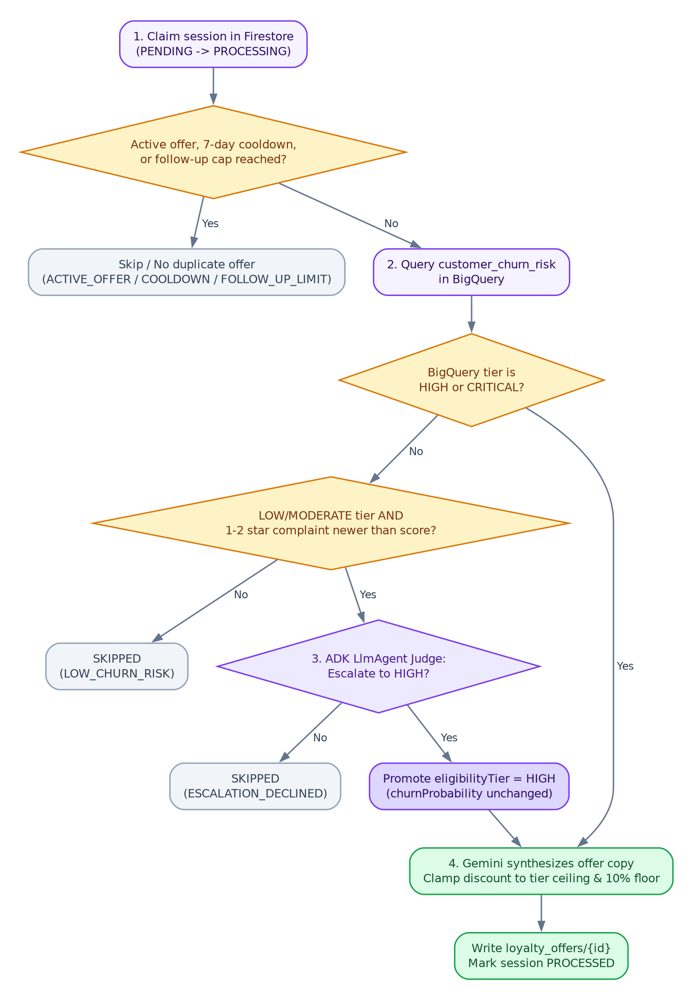

# Redwood Retail: Architecture

For context about this solution and for how to deploy and run the demo, see [demo_flow.md](demo_flow.md).

## 1. Architecture Overview

Two independent event paths share the database:

- **Replication:** Order and customer writes in Firestore stream into BigQuery
  within seconds via Eventarc and `redwood-cdc`.
- **Retention:** A login session write in Firestore triggers
  `redwood-agent-bridge` and `redwood-loyalty-agent` in Vertex AI Agent Engine,
  which reads `customer_churn_risk` from BigQuery and writes offers back to
  Firestore.

---

## 2. Client

The client in [mobile_client/](../mobile_client) consists of a React frontend
and a FastAPI backend serving two interfaces:

- **Mobile App (`/`)**: The customer-facing retail storefront where users sign
  in as one of the demo personas (`demo1` or `demo2`), browse products, receive
  and claim loyalty offers, place orders, and submit star ratings and complaint
  feedback.
- **Redwood Console (`/console`)**: An operator dashboard showing real-time
  pipeline hop latencies, live Firestore session and offer documents, BigQuery
  churn scores, and demo controls (**Reset Demo** and **Recalculate Churn**).
  Served at `/console.html` under the Vite dev server.

Key interactions:

1. **Login session creation:** Signing in calls `POST /api/session/login`, which
   writes a document to `customer_sessions/{sessionId}` with
   `agentProcessingStatus: "PENDING"`. That write triggers the retention
   pipeline.
2. **Live offer delivery via SSE (Server-Sent Events):** The backend attaches a
   Firestore `on_snapshot` listener to the customer's session and active offers,
   pushing updates to the browser over **Server-Sent Events (SSE)**—a persistent,
   one-way HTTP stream that delivers database changes to the UI the instant the
   agent writes them, without client polling.
3. **Order placement and feedback:** Submitting an order (`POST /api/orders/submit`)
   validates any claimed `offerId` server-side, applies the discount and free
   express shipping from the `loyalty_offers` document, and writes the order to
   `retail/{orderId}`. Rating an order updates `customerFeedback` (including
   `rating`, `complaintReason`, and `feedbackTimestamp`) on that order document.

---

## 3. Firestore

Database `redwood` runs **Firestore Enterprise edition in Native mode** with
point-in-time recovery enabled.

| Collection | Written by | Purpose |
|---|---|---|
| `retail` | Seeder, mobile client | Customer orders and embedded `customerFeedback` |
| `customers` | Seeder, mobile client | Customer profiles and spend rollups |
| `customer_sessions` | Mobile client, loyalty agent | One document per login (`PENDING` → `PROCESSING` → `PROCESSED` / `SKIPPED`) |
| `loyalty_offers` | Loyalty agent, mobile client | Personalized retention offers (`ACTIVE`, `CLAIMED`, `REDEEMED`, `SUPERSEDED`) |
| `pipeline_traces` | CDC service, bridge, loyalty agent | Per-hop execution timestamps and latencies for the Redwood Console |

`customer_sessions` and `loyalty_offers` have Firestore TTL policies (30 and 90
days) on `ttlExpiryAt` so documents from demo runs expire automatically.

---

## 4. Cloud Run and Eventarc (Replication & Routing)

Everything that runs at demo time runs on Cloud Run. Two services are triggered
by Eventarc from Firestore document changes (`application/protobuf`
CloudEvents); two are called directly over HTTP.

### CDC Replication (`redwood-cdc`)

Implemented in [cdc_service/](../cdc_service) and triggered by writes to
`retail` and `customers`. It decodes the Firestore protobuf payload and streams
rows into BigQuery using the **BigQuery Storage Write API**:

| BigQuery Table | Shape | Purpose |
|---|---|---|
| `retail_cdc` | Append-only ledger | Full audit trail of every order create, update, and delete |
| `retail_current` | `PRIMARY KEY (order_id) NOT ENFORCED` | Current state of orders using Storage Write `UPSERT` and `DELETE` |
| `customers_current` | `PRIMARY KEY (customer_id) NOT ENFORCED` | Current state of customer profiles using `UPSERT` and `DELETE` |

Each keyed write includes `_CHANGE_SEQUENCE_NUMBER` so out-of-order Eventarc
deliveries cannot overwrite a newer state. For initial seeding or full
reconciliation, [cdc_service/backfill.py](../cdc_service/backfill.py) walks the
Firestore collections and streams every document through the same Storage Write
path.

### Agent Bridge (`redwood-agent-bridge`)

Implemented in [agent_bridge/](../agent_bridge) and triggered by writes to
`customer_sessions`. Because Vertex AI Agent Engine is not a direct Eventarc
target, the bridge receives the session CloudEvent, verifies that
`agentProcessingStatus == "PENDING"` (ignoring subsequent status updates written
by the agent itself), resolves `redwood-loyalty-agent` by display name, and
invokes `query(session_id)` on Agent Engine.

### Churn Function (`redwood-churn`)

Implemented in [churn_service/](../churn_service) as a Cloud Run function
(`functions-framework`), provisioned by
[churn_service.tf](../terraform/churn_service.tf). `POST`ing to it renders and
executes [bigquery_churn_sentiment_analysis.sql](../bigquery_churn_sentiment_analysis.sql)
— baked into the image, so the on-demand run and the daily scheduled query
cannot drift apart — and **streams the log back** as `text/plain`, one line per
chunk, which is what fills the console's Event Log while the model retrains.

Two modes: `full` retrains and rescores; `rescore` runs the scoring `MERGE`
alone against the existing model, which is what a demo reset uses.

Because the response streams, the HTTP status is committed before the first
BigQuery statement runs, so the outcome is reported **in-band** as a final
`[exit 0]` or `[exit 1]` line. The console branches on that line. Scaling is
`min 0 / max 2` with concurrency 1: the pipeline is bursty and idempotent, and
nothing about it needs a warm instance.

### App and Console (`redwood-app`)

Implemented in [mobile_client/](../mobile_client) and provisioned by
[mobile_app.tf](../terraform/mobile_app.tf). One container serves both Vite
bundles and the FastAPI backend: the phone at `/`, the operator's console at
`/console`, the API under `/api`.

Pinned to **exactly one instance** (`min = max = 1`, uvicorn `--workers 1`).
The console's SSE fan-out, telemetry counters and recent-orders buffer are
process-local, so a second instance would serve half the console's clients a
different reality. For the same reason `cpu_idle = false`: Firestore
`on_snapshot` callbacks arrive on the client library's own threads between
requests, and under request-scoped CPU those threads are throttled and the
console goes quiet.

Neither `redwood-app` nor `redwood-churn` allows unauthenticated access.
Access is `roles/run.invoker` granted to named principals, and a browser has no
way to present a Google ID token, so requests are signed by a local tunnel
([scripts/run_proxy.py](../scripts/run_proxy.py)) that `deploy.sh` opens as its
last step.

That tunnel exists instead of `gcloud run services proxy`, which cannot
authenticate to an IAM-only service from a developer workstation. With user
credentials it presents a token whose audience is the gcloud OAuth client
rather than the service URL, and Cloud Run answers 401; with
`--impersonate-service-account`, which would produce the right audience, the
proxy binary refuses the credential type outright. The tunnel reuses
[idtoken.py](../mobile_client/backend/idtoken.py) — the same impersonation the
backend uses — and streams responses rather than buffering them, because the
console is built on SSE.

---

## 5. BigQuery and Churn Model

All feature engineering, model training, evaluation, and batch scoring run inside
BigQuery in [bigquery_churn_sentiment_analysis.sql](../bigquery_churn_sentiment_analysis.sql).

- **Point-in-time feature engineering:** `customer_features(as_of)` computes a
  customer's feature vector across four pillars (demographics, transactional
  metrics, app engagement, and customer support/feedback sentiment) as of any
  given date. Training calls it at `CURRENT_DATE() - 90` with a 90-day churn
  label horizon (`customer_churn_labels`), while live inference calls the exact
  same function at `CURRENT_DATE()`.
- **Model (`customer_churn_model`):** A BigQuery ML `LOGISTIC_REG` model trained
  with `auto_class_weights = TRUE` to handle class imbalance.
- **Scoring (`customer_churn_risk`):** `ML.PREDICT` scores every active customer
  and `MERGE`s the resulting `churn_probability` (`[0.0, 1.0]`),
  `churn_risk_tier` (`LOW < 0.40 <= MODERATE < 0.60 <= HIGH < 0.80 <= CRITICAL`),
  and `calculation_timestamp` into `customer_churn_risk`.
- **Scheduled & on-demand refresh:** A BigQuery scheduled query runs the pipeline
  daily at 03:00 UTC ([churn_schedule.tf](../terraform/churn_schedule.tf)), and
  the Redwood Console triggers the same SQL on demand through the
  `redwood-churn` function — a full retrain from **Recalculate Churn**, or a
  scoring-only `rescore` as step 3 of **Reset Demo**.

---

## 6. Loyalty Agent in Agent Engine

The retention agent in [loyalty_agent/](../loyalty_agent) is deployed to
**Vertex AI Agent Engine** (`redwood-loyalty-agent`) via `LoyaltyAgentEngine`
([main.py](../loyalty_agent/main.py)).

### How the agent processes a login

1. **Transactional claim & guardrails:** The agent atomically moves the session
   from `PENDING` to `PROCESSING` in Firestore. It checks `loyalty_offers` to
   ensure the customer does not already have an `ACTIVE` offer, is not within
   the 7-day cooldown, and has not exceeded the follow-up offer cap
   (`offerSequence: 2`, where a redeemed initial offer allows at most one
   stepped-down follow-up offer).
2. **BigQuery churn gate:** The agent queries `customer_churn_risk`. Customers
   scored `HIGH` or `CRITICAL` immediately qualify for an offer.
3. **Complaint escalation (`ADK LlmAgent`):** When a `LOW` or `MODERATE`
   customer's most recent order carries a `rating <= 2`, the agent invokes an
   ADK `LlmAgent` judge ([escalation.py](../loyalty_agent/escalation.py)).
   Because BigQuery scores in batch, the complaint may or may not be inside
   `churn_probability` already; the brief states which, comparing
   `feedbackTimestamp` against `calculation_timestamp` and telling the judge
   whether the complaint landed before or after the score. That comparison is
   an input to the judgement, not a gate in front of it — a complaint the model
   already weighed is a strong reason to decline, and the judge has to say so
   in its own words rather than the agent dropping the case silently. The judge
   returns a structured `EscalationVerdict` (`escalate: bool` and a
   one-sentence `escalationReason`). If approved, `eligibilityTier` becomes
   `HIGH` while BigQuery's `churnRiskTier` and `churnProbability` stay
   unchanged.
4. **Offer synthesis with deterministic bounds:** Gemini generates personalized
   offer copy and proposes a discount percentage. The agent clamps the discount
   to the customer's loyalty tier ceiling and margin floor before writing
   `loyalty_offers/{offerId}` and marking the session `PROCESSED`.

### What a skip records

Every session that ends without an offer carries `skipReason`, and every
session that reached the escalation path also carries `escalationGate` naming
the branch it took. Where a sentence is owed it is in `skipDetail`.

| `escalationGate` | `skipReason` | `skipDetail` |
|---|---|---|
| `JUDGED` | `ESCALATION_DECLINED` | the judge's own sentence |
| `NO_COMPLAINT` | `LOW_CHURN_RISK` | none — nothing happened worth narrating |
| `TIER_NOT_CANDIDATE` | `LOW_CHURN_RISK` | names the allow-list |
| `JUDGE_UNAVAILABLE` | `LOW_CHURN_RISK` | says the judge could not be reached |

`JUDGE_UNAVAILABLE` is deliberately not `ESCALATION_DECLINED`: an outage is not
a judgement, and a decision log that conflates the two is worse than one that
records neither.

### Thresholds ([config.py](../loyalty_agent/config.py))

| Setting | Value |
|---|---|
| Qualifying churn tiers | `HIGH`, `CRITICAL` |
| Churn tier boundaries | `LOW < 0.40 ≤ MODERATE < 0.60 ≤ HIGH < 0.80 ≤ CRITICAL` |
| Escalation candidate tiers | `LOW`, `MODERATE` (`ESCALATION_CANDIDATE_TIERS`) |
| Complaint rating threshold | `≤ 2` stars on the customer's most recent order |
| Complaint freshness | reported to the judge, not gated on |
| Offer cooldown & validity | 7-day cooldown, 14-day validity, max 1 follow-up (`offerSequence: 2`) |
| Discount ceilings by loyalty tier | `ENTERPRISE_VIP` 25%, `RETAIL_PRO` 20%, `STANDARD_LOYALTY` 15%, `CASUAL` 12% |
| Margin floor | 10% |
