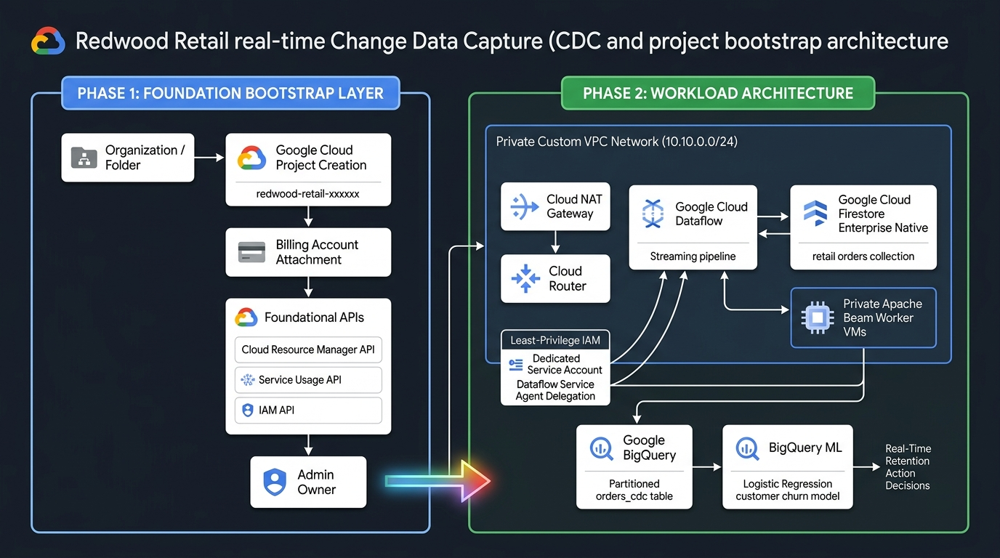

# Redwood Retail: Architecture, Security & Operational Deployment Guide

This document provides a comprehensive technical overview of the **Redwood Retail** architecture, including the decoupled project bootstrap foundation, real-time Change Data Capture (CDC) streaming from Firestore Enterprise Native to BigQuery, the identity and IAM security model, and strict Python virtual environment execution.

---

## 1. System Architecture Overview

Redwood Retail is architected as a **two-phase, layered infrastructure model** that separates cloud project governance from workload lifecycle management.



### Core Components Summary

| Layer | Component | Implementation | Primary Responsibility |
| :--- | :--- | :--- | :--- |
| **Phase 1** | **Project Bootstrap** | [`terraform/bootstrap/`](../terraform/bootstrap/) | Creates Google Cloud Project, binds billing account, enables foundation APIs, and assigns administrative ownership. |
| **Phase 2** | **Network Isolation** | [`terraform/network.tf`](../terraform/network.tf) | Provisions custom VPC (`10.10.0.0/24`), private subnet, Cloud Router, and Cloud NAT gateway. Workers have no public IPs. |
| **Phase 2** | **Source OLTP** | [`terraform/firestore.tf`](../terraform/firestore.tf) | Provisions Firestore Enterprise in Native Mode (`database: redwood`, `collection: retail`) with Point-in-Time Recovery (PITR). |
| **Phase 2** | **Streaming CDC** | [`terraform/dataflow.tf`](../terraform/dataflow.tf) | Deploys Apache Beam streaming job on Google Cloud Dataflow with private worker VMs. |
| **Phase 2** | **Analytics & BQML** | [`terraform/bigquery.tf`](../terraform/bigquery.tf) | Manages `redwood_retail` dataset, day-partitioned/clustered `orders_cdc` table, and BQML logistic regression customer churn model. |

---

## 2. Phase 1: Project Foundation & Bootstrap Architecture

### Design Rationale: Decoupled Lifecycle & Privilege Separation

In enterprise and sandbox environments (such as **Altostrat** and **Argolis**), provisioning a cloud project requires elevated organizational permissions (`roles/resourcemanager.projectCreator`, `roles/billing.user`) typically held by an administrator identity (e.g., `admin@<domain>.altostrat.com`). Conversely, workload deployments only require project-level `roles/owner` or `roles/editor`.

Decoupling the project bootstrap layer into [`terraform/bootstrap/`](../terraform/bootstrap/) provides:
1. **Lifecycle Protection**: Running teardown operations on the workload layer (`./deploy.sh --teardown` or `terraform destroy`) drains Dataflow pipelines and removes databases without accidentally destroying the parent GCP project, disconnecting billing, or revoking IAM bindings.
2. **Network Cleanliness**: The project is provisioned with `auto_create_network = false`. This prevents the default GCP VPC network and its overlapping subnets from colliding with the custom `10.10.0.0/24` Dataflow private network.
3. **Foundational API Guarantee**: Enables `serviceusage.googleapis.com`, `cloudresourcemanager.googleapis.com`, and `iam.googleapis.com` before any workload resources attempt service checks.

### Bootstrap Module Inputs & Outputs

* **Input Variables** ([`variables.tf`](../terraform/bootstrap/variables.tf)):
  * `billing_account_id` (Required): Google Cloud Billing Account ID (e.g. `01AC1E-13E64F-F130D4`).
  * `org_id` / `folder_id` (Optional): Numeric organization ID or folder ID for placement.
  * `project_prefix`: Prefix for the generated project ID (default: `redwood-retail`).
  * `project_id`: Explicit project ID override if a specific name is required.
  * `primary_owner_user_email`: Email to grant `roles/owner` upon creation.
* **Outputs** ([`outputs.tf`](../terraform/bootstrap/outputs.tf)):
  * `project_id`: The created unique project ID.
  * `env_config_snippet`: Ready-to-copy `.env` configuration block.

---

## 3. Phase 2: Workload & Streaming CDC Architecture

### 1. Private Network & Outbound NAT Gateway
Dataflow streaming worker VMs run in **private IP mode** (`--no_use_public_ips`):
* **Subnet**: `redwood-dataflow-subnet` (`10.10.0.0/24`) with `private_ip_google_access = true`.
* **Cloud Router & NAT**: `redwood-dataflow-router` and `redwood-dataflow-nat` route worker outbound traffic (e.g., container image pulls, PyPI dependencies) through Google Cloud NAT without exposing worker VMs to the public internet.
* **Internal Firewall**: Allows TCP ports `12345` and `12346` strictly between `10.10.0.0/24` worker instances for shuffle and pipeline communication.

### 2. Firestore Enterprise Native Mode
* **Database Edition**: `ENTERPRISE` with Point-in-Time Recovery (`--enable-pitr`).
* **Data Access Mode**: Native Firestore API enabled (`--enable-firestore-data-access`) and real-time updates enabled (`--enable-realtime-updates`).
* **Data Synthesis**: [`generate_retail_dataset.py`](../generate_retail_dataset.py) utilizes parallel multiprocessing workers to seed rich e-commerce transactions and 4-pillar customer profiles (spend, engagement, satisfaction, loyalty).

### 3. Cloud Dataflow Streaming Pipeline
* Implemented in [`dataflow/dataflow_firestore_to_bigquery_beam.py`](../dataflow/dataflow_firestore_to_bigquery_beam.py) using Apache Beam Python SDK.
* Uses `PeriodicImpulse` to poll document versions from Firestore Enterprise Native, deduplicates processed snapshots by `version_key`, and transforms documents into strongly-typed CDC event dictionaries.
* Streams records directly into BigQuery using `Method.STREAMING_INSERTS`.

### 4. BigQuery Data Warehouse & Predictive ML
* **CDC Sink Table**: `orders_cdc`, partitioned by `DAY` on `change_timestamp` and clustered by `order_id`, `customer_id`, and `order_status`.
* **Feature Engineering**: Dynamic view `${BIGQUERY_HISTORICAL_VIEW}` aggregates lifetime spend, monthly login cadence, cart abandonment counts, return frequencies, and customer sentiment scores.
* **BigQuery ML Model**: Trains a `logistic_reg` classifier with automated class weights (`auto_class_weights = TRUE`) and L2 regularization to output customer churn probabilities and map automated retention codes.

---

## 4. Security & Identity Architecture

### Custom Worker Service Account Least-Privilege Role Matrix

The dedicated service account `dataflow-redwood-sa@<project-id>.iam.gserviceaccount.com` is configured in [`terraform/iam.tf`](../terraform/iam.tf) with least-privilege permissions:

| Target Resource | Role | Purpose |
| :--- | :--- | :--- |
| Project | `roles/datastore.owner` | Allows Dataflow workers to stream documents from Firestore Native collections. |
| Project | `roles/bigquery.dataEditor` | Permits writing streaming records into BigQuery `orders_cdc` table. |
| Project | `roles/bigquery.jobUser` | Permits BigQuery job execution. |
| Project | `roles/dataflow.worker` | Grants permissions required for Dataflow worker execution. |
| Project | `roles/dataflow.admin` | Permits pipeline administration and autoscaling coordination. |
| GCS Bucket | `roles/storage.objectAdmin` | Allows staging pipeline dependencies and writing temporary files. |

### Critical: Dataflow Service Agent Role Delegation

When running Dataflow jobs with a **custom worker service account**, Google Cloud's managed Dataflow Service Agent (`service-<project-number>@dataflow-service-producer-prod.iam.gserviceaccount.com`) must be granted delegation rights on that worker account.

Without these bindings, worker VM creation will fail with:
```
The Dataflow service agent cannot access the worker service account.
```

To resolve this, [`terraform/iam.tf`](../terraform/iam.tf) provisions explicit service account IAM bindings:
```hcl
resource "google_service_account_iam_member" "dataflow_sa_actas" {
  service_account_id = google_service_account.pipeline_sa.name
  role               = "roles/iam.serviceAccountUser"
  member             = "serviceAccount:service-${data.google_project.project.number}@dataflow-service-producer-prod.iam.gserviceaccount.com"
}

resource "google_service_account_iam_member" "dataflow_sa_service_agent" {
  service_account_id = google_service_account.pipeline_sa.name
  role               = "roles/dataflow.serviceAgent"
  member             = "serviceAccount:service-${data.google_project.project.number}@dataflow-service-producer-prod.iam.gserviceaccount.com"
}
```

---

## 5. Python Virtual Environment (`.venv`) Standard

To prevent environment drift and PEP 668 system-package conflicts, **all Python executions, script runners, and dependency installations are strictly isolated to a virtual environment (`.venv`)**:

1. **Automatic Initialization**:
   If an active virtual environment is not detected, [`deploy.sh`](../deploy.sh) automatically creates `.venv` at the repository root using `python3 -m venv` (with automated fallback to `--without-pip` + bootstrap `get-pip.py` when system `ensurepip` is absent).
2. **Runner Enforcement**:
   [`deploy.sh`](../deploy.sh) and [`launch_dataflow_job.sh`](../terraform/scripts/launch_dataflow_job.sh) resolve `PYTHON_EXEC` exclusively to `$VIRTUAL_ENV/bin/python3` or `$REDWOOD_DIR/.venv/bin/python3`. System Python execution is prohibited.
3. **Repository Cleanliness**:
   [`.gitignore`](../.gitignore) strictly excludes `.venv/` and `*.tfvars` files from being committed to version control.

---

## 6. End-to-End Operational Lifecycle

### Scenario A: Standalone Project Creation + Workload Deployment
```bash
# 1. Configure bootstrap variables
cp terraform/bootstrap/terraform.tfvars.example terraform/bootstrap/terraform.tfvars
# Edit terraform/bootstrap/terraform.tfvars with your billing account and org/folder ID

# 2. Execute full automated deployment with project bootstrap
./deploy.sh --create-project --auto-approve
```

### Scenario B: Deployment into Existing Project
```bash
# 1. Configure .env with existing project ID
cp .env.example .env
# Set GCP_PROJECT_ID="your-project-id"

# 2. Run deploy
./deploy.sh
```

### Deployment CLI Flags Reference

* `./deploy.sh`: Standard deployment against configured `.env`.
* `./deploy.sh --create-project` (`-p`): Provisions a fresh GCP project via `terraform/bootstrap` before deploying components.
* `./deploy.sh --seed-count <N>` (`-s <N>`): Number of synthetic transaction documents to generate (default: 250).
* `./deploy.sh --dry-run`: Runs Terraform plan on bootstrap and workload layers without modifying resources.
* `./deploy.sh --skip-seed`: Deploys infrastructure without seeding sample orders.
* `./deploy.sh --skip-bqml`: Deploys infrastructure without training BigQuery ML models.
* `./deploy.sh --teardown` (`-t`): Cleanly drains Dataflow jobs and destroys workload infrastructure via Terraform.

---

## 7. Verification & Troubleshooting Matrix

### 1. Verify Project Creation & APIs
```bash
gcloud projects describe <PROJECT_ID>
gcloud services list --enabled --project=<PROJECT_ID>
```

### 2. Verify Firestore Enterprise Native Database
```bash
gcloud alpha firestore databases describe --database=redwood --project=<PROJECT_ID> \
  --format="table(name,databaseEdition,type,firestoreDataAccessMode,realtimeUpdatesMode)"
```

### 3. Verify Cloud Dataflow Streaming Pipeline
```bash
# List active jobs
gcloud dataflow jobs list --region=europe-west4 --project=<PROJECT_ID> --status=active

# Check private worker VM instances in subnet
gcloud compute instances list --project=<PROJECT_ID>
```

### 4. Query Replicated BigQuery Records
```bash
# Verify row counts in orders_cdc table
.venv/bin/python3 -c "
from google.cloud import bigquery
client = bigquery.Client(project='<PROJECT_ID>')
for row in client.query('SELECT COUNT(*) AS total FROM \`<PROJECT_ID>.redwood_retail.orders_cdc\`').result():
    print('Total replicated CDC records:', row.total)
"
```

### 5. Run BigQuery ML Churn Inference
```bash
.venv/bin/python3 run_bigquery_analysis.py --execute
```
