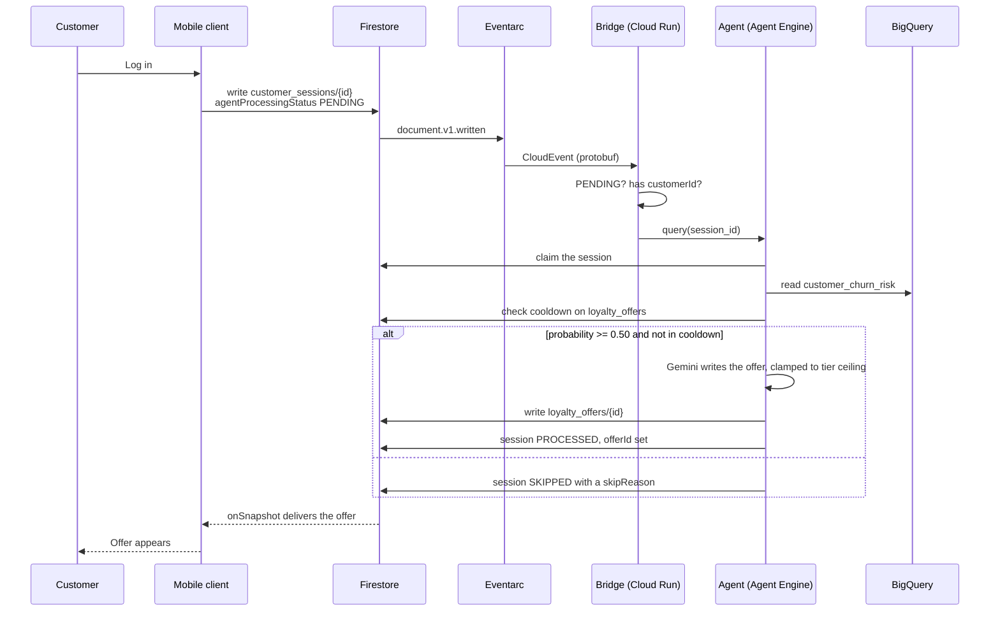

# Redwood Retail: Deployment and Demo Flow

How to stand the system up, how to run the demo, and what to do when a step
does not behave. For what the pieces are and why they were built that way, see
[architecture.md](architecture.md).

---

## 1. Prerequisites

- A Google Cloud project with billing enabled, or `--create-project` to have
  one provisioned.
- `gcloud`, `terraform` and `python3` on the path.
- Application default credentials: `gcloud auth application-default login`.
- A `.env` at the repository root. Copy [.env.example](../.env.example) and set
  at minimum `GCP_PROJECT_ID` and `GCP_REGION`.

`deploy.sh` creates and populates a `.venv/` itself, so no manual Python setup
is needed.

> [!NOTE]
> The reference environment is project `elevate-cyvisser` in `europe-west4`,
> Firestore database `redwood`, BigQuery dataset `redwood_retail`.

---

## 2. Deploying

```bash
./deploy.sh
```

One command. Six steps, in this order and for these reasons:

| Step | What it does | Why here |
|---|---|---|
| 1/6 | Builds and pushes the CDC and bridge images | Terraform deploys by digest, so the images must exist first |
| 2/6 | `terraform apply` | Creates everything except the agent |
| 3/6 | Seeds Firestore, then reconciles BigQuery | Reconciliation is unconditional, see below |
| 4/6 | Builds feature views, trains the model, scores every customer | The agent needs scores to read |
| 5/6 | Deploys the agent to Agent Engine | Stages through the bucket Terraform created |
| 6/6 | Prints the summary | |

Step 3 reconciles BigQuery on every run rather than only when the table looks
empty. Firestore emits no change event when a write leaves a document
byte-identical, and the seeder is deterministic, so a re-run without
`--drop-existing` produces thousands of no-op writes and zero events. Relying
on the event path alone would silently leave BigQuery stale.

Step 5 runs last because the bridge resolves the agent lazily on its first
request. Deploying the agent after the bridge does not leave a dangling
reference.

### Useful variations

```bash
./deploy.sh --dry-run            # Validate config and show the Terraform plan
./deploy.sh --skip-image-build   # Reuse the images already in Artifact Registry
./deploy.sh --skip-seed          # Leave Firestore as it is
./deploy.sh --skip-bqml          # Do not retrain the churn model
./deploy.sh --skip-agent-deploy  # Leave the deployed agent alone
./deploy.sh --seed-count 1000    # Seed 1,000 customers instead of 400
./deploy.sh --create-project     # Provision a new project first
```

The `--skip-*` flags matter in practice: a full run rebuilds two container
images, retrains the model and redeploys the agent, and the agent deployment
alone takes two to three minutes.

### Verifying without running the demo

```bash
./deploy.sh --run-tests      # Offline self-tests for the CDC service and the agent
./deploy.sh --verify-demo    # Live check against the deployed stack
```

`--verify-demo` writes a real session for each demo customer, waits for the
agent, asserts the outcome and cleans up after itself. It deliberately does not
call the bridge or the agent directly, so a pass means the whole chain worked.

---

## 3. The two demo customers

The seeder creates two personas with deliberately opposite histories, so the
demo shows the agent deciding rather than always issuing.

| | `cust_demo1` | `cust_demo2` |
|---|---|---|
| Behaviour | Buying regularly | Lapsed |
| Days since last purchase | 21 | 196 |
| Churn probability | 0.0633 | 0.9239 |
| Tier | LOW | CRITICAL |
| Agent decision | Skip | Issue an offer |

Both are linked to the IAM principals `demo1-user@` and `demo2-user@`, which
Terraform provisions.

---

## 4. The demo flow



### Triggering it by hand

Until the mobile client is wired up, write the session directly. Anything that
writes a document with `customerId` and `agentProcessingStatus: "PENDING"`
into `customer_sessions` starts the flow.

```bash
source .venv/bin/activate
set -a && source .env && set +a
python scripts/verify_demo_flow.py --customer cust_demo2 --keep
```

`--keep` leaves the session and the offer in place so they can be shown in the
console.

### What to expect

Measured against the live environment:

| Case | Outcome | Time |
|---|---|---|
| `cust_demo2`, first call | `PROCESSED`, ACTIVE offer at 15%, churn 0.9296, CRITICAL | ~21s |
| `cust_demo2`, warm | Same | ~6s |
| `cust_demo1` | `SKIPPED`, `LOW_CHURN_RISK`, no offer | ~2s |
| `cust_demo2` again, offer still active | `PROCESSED`, `ACTIVE_OFFER_ALREADY_EXISTS`, no duplicate | ~3s |

The first call of a session pays an Agent Engine cold start. If the demo is
being shown live, run one throwaway session first.

### Resetting between runs

An active offer suppresses the next one, which is correct behaviour and
confusing on stage. Clear it before demoing:

```bash
source .venv/bin/activate && python - <<'PY'
from google.cloud import firestore
fs = firestore.Client(project="elevate-cyvisser", database="redwood")
for c in ("customer_sessions", "loyalty_offers"):
    n = 0
    for d in fs.collection(c).stream():
        d.reference.delete(); n += 1
    print(f"{c}: deleted {n}")
PY
```

---

## 5. What to show

A suggested order, roughly ten minutes:

1. **Firestore console**, `customer_sessions` empty, `loyalty_offers` empty.
2. **BigQuery**, `customer_churn_risk` — 400 scored customers, and the two
   demo customers at opposite ends:
   ```sql
   SELECT customer_id, churn_probability, churn_tier, recommended_action
   FROM `elevate-cyvisser.redwood_retail.customer_churn_risk`
   WHERE customer_id IN ('cust_demo1', 'cust_demo2');
   ```
3. **Trigger a session for `cust_demo1`.** Nothing is issued. Point at
   `skipReason: LOW_CHURN_RISK` on the session document. The agent decided not
   to spend margin.
4. **Trigger a session for `cust_demo2`.** An offer appears in
   `loyalty_offers` within seconds, with the churn probability and tier that
   justified it recorded on the document.
5. **Trigger `cust_demo2` again.** No second offer.
   `ACTIVE_OFFER_ALREADY_EXISTS`. The guardrails are real.
6. **Place an order through the mobile client** (when available) and show the
   row arriving in `retail_cdc` within seconds.

The point worth making in step 4 is that no part of the path was polled or
scheduled. The login itself caused the offer.

---

## 6. Troubleshooting

### The session stays PENDING

Work down the chain in this order.

**Is the trigger delivering?**
```bash
gcloud eventarc triggers describe redwood-agent-sessions \
  --location=europe-west4 --project=elevate-cyvisser
```

**Is the bridge receiving and what did it decide?**
```bash
gcloud logging read \
  'resource.type="cloud_run_revision" AND resource.labels.service_name="redwood-agent-bridge"' \
  --project=elevate-cyvisser --limit=50 --freshness=10m \
  --format='value(textPayload)'
```
`Ignoring customer_sessions/... : status is ...` means the document was not
`PENDING`. `Resolved agent engine ...` confirms the lookup succeeded.

**Did the agent fail?**
```bash
gcloud logging read \
  'resource.type="aiplatform.googleapis.com/ReasoningEngine"' \
  --project=elevate-cyvisser --limit=200 --freshness=1h \
  --format='value(textPayload)' | grep -i "error\|no module\|traceback"
```

> [!IMPORTANT]
> Agent Engine reports almost every startup failure as a bare
> `failed to start and cannot serve traffic`. That message contains no
> diagnostic information. The real cause is always in Cloud Logging.

### An offer is never issued for anyone

Check the cooldown index exists and is `READY`:

```bash
gcloud firestore indexes composite list \
  --database=redwood --project=elevate-cyvisser
```

`loyalty_offers (customerId ASC, createdAt DESC)` must be present. Without it
the cooldown query raises, the agent treats that as being in cooldown, and
every offer is suppressed with nothing logged.

### Rows are not reaching BigQuery

Confirm the counts line up:
```bash
bq query --use_legacy_sql=false --project_id=elevate-cyvisser \
  'SELECT
     (SELECT COUNT(*) FROM `redwood_retail.retail_current`) AS orders,
     (SELECT COUNT(*) FROM `redwood_retail.customers_current`) AS customers'
```

If they are short, reconcile rather than reseeding:
```bash
source .venv/bin/activate && set -a && source .env && set +a
python cdc_service/backfill.py
```
It is idempotent and runs at roughly 138 documents per second.

If the CDC service is deployed but events fail to parse, check that Terraform
rolled out the current image. A mutable `:latest` tag looks unchanged to
Terraform, which is why both services are pinned by digest.

### Churn scores look wrong or stale

Check when they were last refreshed:
```bash
bq query --use_legacy_sql=false --project_id=elevate-cyvisser \
  'SELECT MAX(calculation_timestamp) AS last_run, COUNT(*) AS n
   FROM `redwood_retail.customer_churn_risk`'
```

Expect 400 rows and a timestamp from the last 03:00 UTC. To rerun immediately:
```bash
source .venv/bin/activate && python run_bigquery_analysis.py --execute --report
```

Before concluding the model is broken, read
`customer_churn_model_evaluation`. An AUC near 1.0 indicates leakage, not
success.

### Terraform appears to hang

It is waiting on an interactive prompt for a variable it was not given. Pass
`-input=false` and export the full `TF_VAR_*` set, or just use `deploy.sh`,
which does both.

---

## 7. Tearing down

```bash
./teardown.sh          # wraps ./deploy.sh --teardown
```

> [!CAUTION]
> This destroys the Firestore database, the BigQuery dataset and every Cloud
> Run service in the project's Redwood footprint. The Agent Engine deployment
> is not Terraform-managed and must be deleted separately.

```bash
source .venv/bin/activate && python - <<'PY'
import vertexai
from vertexai import agent_engines
vertexai.init(project="elevate-cyvisser", location="europe-west4")
for e in agent_engines.list():
    if e.display_name == "redwood-loyalty-agent":
        print("deleting", e.resource_name)
        e.delete(force=True)
PY
```
