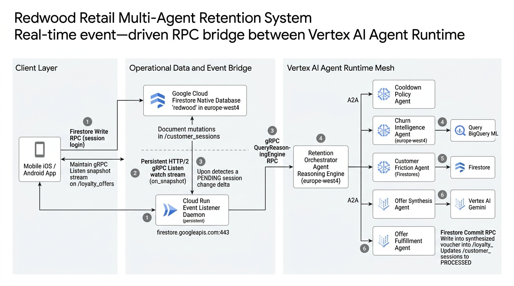

# Firestore to Agent Runtime Real-Time RPC Integration & Data Flow Guide

**Project:** Redwood Retail (Google Cloud Architecture)  
**Target Platform:** Google Cloud Firestore Enterprise Native & Google Cloud Agent Runtime (Vertex AI Reasoning Engines)  
**Region:** `europe-west4` (Eemshaven)  
**Database:** `projects/redwood-retail-949ec9/databases/redwood`  
**Deployer / Architecture Persona:** Practice CE / Cloud Architect / Enterprise Operator (Level 400 Deep Dive)

---

## 1. Executive Summary & RPC Topology

A common misconception in cloud databases is that Google Cloud Firestore internally initiates outbound remote procedure calls (RPCs) directly to external microservices or AI endpoints when a document is written. 

Firestore is a strictly isolated, multi-tenant document database engine. Firestore's storage nodes do **not** emit arbitrary outbound network calls. Instead, real-time event-driven agent orchestration is achieved by establishing an inverted streaming pipeline: a subscriber daemon (e.g. running on Cloud Run or a dedicated worker) maintains an open bidirectional HTTP/2 gRPC `Listen` watch stream against Firestore, intercepting document mutations with sub-50ms latency and converting those database deltas into direct downstream `QueryReasoningEngine` RPC calls on **Vertex AI Agent Runtime**.



---

## 2. End-to-End Sequence of RPC Calls

The end-to-end event lifecycle spans 6 distinct remote procedure calls executed across the Google Cloud global network backbone:

### RPC 1: Mobile Client Ingestion (`Commit` RPC)
* **Caller:** Mobile Client (iOS / Android application running official Firebase / Firestore client SDK).
* **Endpoint:** `firestore.googleapis.com:443`
* **RPC Method:** `google.firestore.v1.Firestore/Commit`
* **Payload:** Document write to `/customer_sessions/{sessionId}` with initial state:
  ```json
  {
    "sessionId": "sess_mobile_91823",
    "customerId": "cust_retail_72871",
    "loginTimestamp": "2026-09-08T03:25:00Z",
    "deviceInfo": {
      "deviceType": "MOBILE_IOS",
      "osVersion": "18.2",
      "appVersion": "5.0.0"
    },
    "status": "PENDING",
    "agentProcessingStatus": "PENDING"
  }
  ```
* **Latency:** ~15–30ms. The document is committed across Paxos quorum storage in `europe-west4`.

---

### RPC 2: Persistent HTTP/2 Watch Stream (`Listen` RPC)
* **Caller:** Event Bridge Daemon (`scripts/run_firestore_agent_bridge.py` or Cloud Run worker).
* **Endpoint:** `firestore.googleapis.com:443`
* **RPC Method:** `google.firestore.v1.Firestore/Listen` (Bidirectional Streaming RPC).
* **Connection Lifecycle:**
  * Established at service boot.
  * Sends a `ListenRequest.add_target` specifying the query target:
    ```
    collection_id: "customer_sessions"
    where: agentProcessingStatus == "PENDING"
    ```
  * Holds the HTTP/2 stream open continuously. If network disconnects occur, the client library automatically executes exponential backoff and passes the `resume_token` to guarantee zero missed events.

---

### RPC 3: Real-Time Stream Delta Delivery (`ListenResponse`)
* **Sender:** Google Cloud Firestore Native Storage Engine.
* **Receiver:** Event Bridge Daemon (`SessionEventListener.on_snapshot_callback` in `loyalty_agent/listener.py`).
* **Protobuf Message:** `google.firestore.v1.ListenResponse`
  * Contains `target_change`, `document_change`, and the updated document snapshot with attributes.
* **Latency:** $< 50\text{ms}$ from write commit to callback execution.
* **Worker Execution:**
  * The callback extracts `sessionId = doc.id`.
  * Instantly submits the task to a Python `ThreadPoolExecutor` worker pool to decouple the gRPC streaming socket from agent reasoning latency.

---

### RPC 4: Agent Runtime Invocation (`QueryReasoningEngine` RPC)
* **Caller:** Event Bridge Daemon worker thread.
* **Endpoint:** `europe-west4-aiplatform.googleapis.com:443`
* **RPC Method:** `google.cloud.aiplatform.v1beta1.ReasoningEngineExecutionService/QueryReasoningEngine`
* **Target Resource:** 
  `projects/1097559589092/locations/europe-west4/reasoningEngines/8917030505170337792` (Retention Orchestrator)
* **Authentication:** OAuth2 / Google Cloud IAM Bearer token generated by the Workstation ADC or Cloud Run Service Account (`dataflow-redwood-sa@redwood-retail-949ec9.iam.gserviceaccount.com`).

---

### RPC 5: Offer Fulfillment & State Persistence (`Commit` RPC)
* **Caller:** Offer Fulfillment Agent running inside Agent Runtime (using attached service account `dataflow-redwood-sa@redwood-retail-949ec9.iam.gserviceaccount.com`).
* **Endpoint:** `firestore.googleapis.com:443`
* **RPC Method:** `google.firestore.v1.Firestore/Commit` (ACID Write Batch / Transaction).
* **Operations:**
  1. Creates document `/loyalty_offers/off_sess_mobile_91823`.
  2. Updates document `/customer_sessions/sess_mobile_91823` to `agentProcessingStatus: "PROCESSED"`.

---

### RPC 6: Client Delivery (`ListenResponse` Push)
* **Sender:** Google Cloud Firestore Native Storage Engine.
* **Receiver:** Mobile Client App.
* **RPC Method:** `google.firestore.v1.Firestore/Listen`
* **Action:** The mobile client holds an active snapshot listener on `/loyalty_offers` where `customerId == :target AND status == 'ACTIVE'`.
* **Delivery Time:** $< 100\text{ms}$ after Agent Runtime commits the document. The retention offer banner renders on the customer's phone instantly.

---

## 3. What Cloud Run Sends to the Reasoning Agent

When Cloud Run triggers the Retention Orchestrator Reasoning Engine, it transmits a **lightweight event reference (the Claim Check pattern)** rather than an entire customer record.

### Request Payload Over the Wire
When invoking `orch_engine.query(session_id=session_id)`, Cloud Run transmits:

```json
{
  "name": "projects/1097559589092/locations/europe-west4/reasoningEngines/8917030505170337792",
  "class_method": "query",
  "input": {
    "session_id": "sess_mobile_91823"
  }
}
```

Or when invoking the canonical A2A protocol task interface:

```json
{
  "name": "projects/1097559589092/locations/europe-west4/reasoningEngines/8917030505170337792",
  "class_method": "handle_task",
  "input": {
    "taskId": "task_sess_mobile_91823",
    "skillId": "orchestrate_retention_flow",
    "parameters": {
      "sessionId": "sess_mobile_91823",
      "customerId": "cust_retail_72871"
    }
  }
}
```

### Why a Thin Reference Instead of a "Fat Payload"?
1. **Sub-Kilobyte Network Overhead:** Transmitting only `session_id` keeps the request payload under $1\text{ KB}$, eliminating serialization bottlenecks.
2. **ACID Concurrency & Freshness:** The session document already exists in Firestore `/customer_sessions/{sessionId}`. Reading directly from Firestore inside Agent Runtime guarantees the agent evaluates the authoritative, latest data state.
3. **Strict Separation of Concerns:** Cloud Run operates strictly as a reactive stream router. ML feature scoring, Gemini prompt synthesis, and multi-agent coordination remain encapsulated within Agent Runtime.

---

## 4. Division of Firestore Write Responsibilities

A key architectural question in this pipeline is: **Does the Reasoning Engine update Firestore or does Cloud Run update Firestore?**

The **Reasoning Engine** owns all domain persistence (loyalty offer creation and terminal session status). **Cloud Run** only performs an initial optimistic state lock.

| Responsibility | Component | Firestore Target | Document Mutation | Architectural Rationale |
| :--- | :--- | :--- | :--- | :--- |
| **In-Flight Lock** | **Cloud Run** (`scripts/run_firestore_agent_bridge.py`) | `/customer_sessions/{id}` | `agentProcessingStatus: "PROCESSING"` | Prevents duplicate worker threads from picking up the same session event during RPC transit. |
| **Offer Creation** | **Reasoning Engine** (`loyalty_agent/agents/fulfillment_agent.py`) | `/loyalty_offers/{offerId}` | Full `LoyaltyOffer` payload (`promoCode`, `discountPercent`, `status: "ACTIVE"`, `validUntil`, `ttlExpiryAt`) | Encapsulation: Fulfillment Agent owns Pydantic schema validation, voucher codes, and TTL expiration rules. |
| **Terminal State** | **Reasoning Engine** (`loyalty_agent/agents/orchestrator_agent.py` & `fulfillment_agent.py`) | `/customer_sessions/{id}` | `agentProcessingStatus: "PROCESSED"` or `"SKIPPED"`<br>`offerId: "off_..."`<br>`skipReason: "COOLDOWN_ACTIVE"` | Atomic completion: Records the final evaluation outcome based on churn gating and cooldown compliance. |
| **Error Fallback** | **Cloud Run** (Catch Block) | `/customer_sessions/{id}` | `agentProcessingStatus: "ERROR"`<br>`errorMessage: "..."` | Only executed if the gRPC RPC to Agent Runtime fails (e.g. timeout or network error). |

---

## 5. Why the Reasoning Engine Returns a Payload to Cloud Run

If the Reasoning Engine updates Firestore directly, **why does it return a payload back to Cloud Run over the RPC?**

### 1. RPC Request-Response Protocol Contract
A remote procedure call (`QueryReasoningEngine`) is a synchronous request-response protocol. Cloud Run holds the gRPC connection open while the Reasoning Engine executes. Every RPC requires a return message. In Vertex AI Agent Runtime, the return value of Python's `query()` method is serialized into the response message delivered back to the caller.

### 2. Zero-Overhead Observability & Cloud Logging
When the Reasoning Engine finishes, it returns a summary dictionary:

```json
{
  "sessionId": "sess_mobile_91823",
  "action": "OFFER_ISSUED",
  "offer": {
    "offerId": "off_sess_mobile_91823",
    "customerId": "cust_retail_72871",
    "discountPercent": 20,
    "promoCode": "WELCOMEBACK20",
    "status": "ACTIVE"
  }
}
```

Cloud Run intercepts this response in `scripts/run_firestore_agent_bridge.py`:
```python
result = self.orch_engine.query(session_id=session_id)
elapsed = time.time() - t0
action = result.get("action", "UNKNOWN")
logger.info("✅ [RPC SUCCESS] Retention Orchestrator completed in %.2fs. Action: %s", elapsed, action)
```
Because the result is returned in the RPC response:
* Cloud Run writes execution latency and decision metrics directly to Cloud Logging and Cloud Monitoring.
* **Cloud Run does NOT need to issue an expensive read back to Firestore** just to find out what happened.

### 3. Dual-Mode Caller Flexibility
The Retention Orchestrator is designed to support both:
* **Asynchronous Event-Driven Mode:** Cloud Run listener daemon captures Firestore mutations and treats the RPC return value as an execution acknowledgment and logging signal.
* **Direct Synchronous Mode:** Verification scripts (`scripts/test_live_native_agent_mesh.py`), admin dashboards, or customer service representative tools call the Reasoning Engine directly and consume the returned offer in memory without setting up a Firestore listener.

---

## 6. Operational CLI Commands

### 1. Run the Bridge Daemon
```bash
# Starts persistent gRPC Listen stream and bridges events to Agent Runtime
./deploy.sh --run-agent
```

### 2. Simulate Real-Time Customer Session
```bash
.venv/bin/python3 -c "
import time
from datetime import datetime, timezone
from google.cloud import firestore

db = firestore.Client(project='redwood-retail-949ec9', database='redwood')
session_id = f'sess_live_rpc_{int(time.time())}'

print(f'Ingesting customer login session: {session_id}...')
db.collection('customer_sessions').document(session_id).set({
    'sessionId': session_id,
    'customerId': 'cust_retail_72871',
    'loginTimestamp': datetime.now(timezone.utc).isoformat(),
    'status': 'PENDING',
    'agentProcessingStatus': 'PENDING'
})
print('Done. Watch daemon terminal for real-time RPC dispatch!')
"
```

### 3. Verify Live Persistence
```bash
# Verify session transition to PROCESSED and inspect the minted offer
.venv/bin/python3 scripts/test_live_native_agent_mesh.py
```
