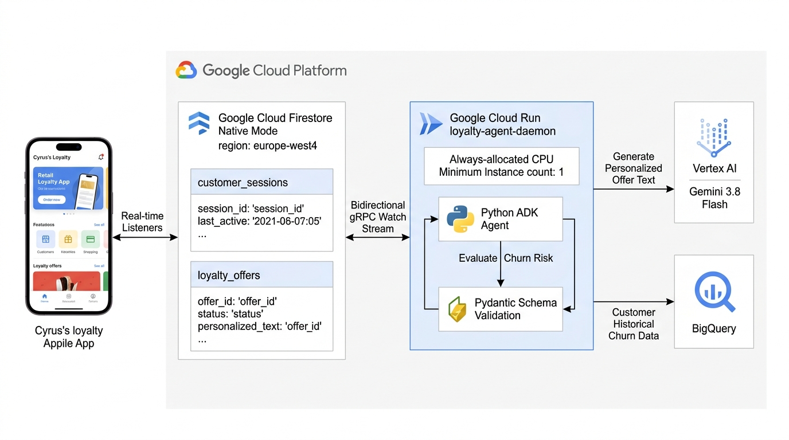

# Redwood Retail: Mobile Frontend & Cloud Run Loyalty Agent Deployment Guide

This guide provides end-to-end instructions for deploying the **Autonomous Loyalty Offer Agent Daemon** on **Google Cloud Run** and integrating it with the mobile frontend developed by Cyrus (Cyrille Visser).

This deployment packages the agent as a dedicated background daemon, enabling the mobile application to interact directly and natively with **Cloud Firestore** through real-time document listeners (`onSnapshot`) with sub-500ms event propagation.

---

## 1. Architectural Overview

The Autonomous Loyalty Offer Agent runs as a persistent background daemon in Google Cloud Run. It maintains an active bidirectional gRPC watch stream (`on_snapshot`) on the Firestore `/customer_sessions` collection, evaluates churn probability using BigQuery ML / cached customer profiles, personalizes retention offers using **Vertex AI Gemini 3.8 Flash**, validates schemas via Pydantic (`loyalty_agent/schemas.py`), and writes vouchers directly to Firestore `/loyalty_offers`.



### Execution Flow
1. **Customer Login**: The mobile application writes a login session document into Firestore collection `customer_sessions`.
2. **Real-Time Detection**: The Cloud Run daemon's persistent gRPC watch stream detects the `PENDING` session document with 0ms polling delay.
3. **Multi-Pillar Churn Assessment**:
   - Checks active offer cooldown (7-day window) via `loyalty_agent/tools/cooldown_tool.py`.
   - Resolves churn risk from the high-throughput Firestore cache (`/customers/{customerId}.baselineChurnRisk`) populated by the 24-hour BigQuery Reverse-ETL sync, falling back to BigQuery ML on-demand if cache is absent.
   - Synthesizes session grievances (app crashes, delivery friction, return rates).
4. **Vertex AI Generative Personalization**:
   - Generates personalized marketing copy and calibrated discount percentages (up to 25% for VIP/Critical churn, 15% for High churn).
   - Deterministic rule engine fallback guarantees zero downtime even if Vertex AI encounters quota limits.
5. **Pydantic Schema Validation**:
   - Validates the generated offer payload strictly against `LoyaltyOffer` in `loyalty_agent/schemas.py`.
6. **Atomic Firestore Persistence**:
   - Atomically commits the voucher into `loyalty_offers` and updates `customer_sessions/{sessionId}.agentProcessingStatus = 'PROCESSED'`.
7. **Mobile Client Reactive Display**:
   - The mobile application's real-time snapshot listener on `loyalty_offers` triggers immediately (< 500ms) to display the personalized retention card.

---

## 2. Prerequisites

Ensure your environment is configured with access to Google Cloud project `redwood-retail-949ec9` and Firestore database `redwood`:

```bash
# Verify active gcloud authentication
gcloud auth list

# Verify .env configuration exists
cat .env
```

Ensure the following variables are set in `.env`:
```ini
GCP_PROJECT_ID=redwood-retail-949ec9
GCP_REGION=europe-west4
FIRESTORE_DATABASE_ID=redwood
FIRESTORE_COLLECTION=retail
BIGQUERY_DATASET=redwood_retail
BIGQUERY_CDC_TABLE=orders_cdc
BIGQUERY_HISTORICAL_VIEW=customer_historical_data
BIGQUERY_CHURN_MODEL=customer_churn_model
GCS_BUCKET_PREFIX=redwood-retail-cdc
DATAFLOW_JOB_NAME=firestore-orders-to-bigquery
DATAFLOW_SERVICE_ACCOUNT=dataflow-worker-sa
```

---

## 3. End-to-End Deployment in 3 Commands

### Step 1: Build & Publish Container Image
Build the container using Google Cloud Build and publish to Google Artifact Registry:

```bash
./deploy.sh --build-agent-image
```

*What this does:*
- Creates the Artifact Registry Docker repository `pipeline-images` in `europe-west4` if it does not already exist.
- Executes `gcloud builds submit` using the root [Dockerfile](file:///usr/local/google/home/ganeshraja/projects/firestore-redwood/Dockerfile).
- Publishes image `europe-west4-docker.pkg.dev/redwood-retail-949ec9/pipeline-images/loyalty-agent-daemon:latest`.

---

### Step 2: Deploy Cloud Run Daemon via Terraform
Deploy the persistent daemon service to Google Cloud Run:

```bash
./deploy.sh --deploy-agent
```

*What this does:*
- Initializes and targets `terraform/loyalty_agent.tf`.
- Provisions `google_cloud_run_v2_service.loyalty_agent_daemon`:
  - **Machine Specs**: 1 vCPU, 1 GiB RAM, Gen2 execution environment.
  - **Always-Allocated CPU (`cpu_idle = false`)**: Disables CPU throttling so the daemon's background gRPC watch stream remains active 24/7.
  - **Minimum Instances**: `min_instance_count = 1` ensures no cold starts or sleep timeouts.
  - **Healthcheck Probes**: Embedded HTTP server on port 8080 responding to `/healthz`.
  - **IAM Privileges**: Grants `roles/aiplatform.user` (Vertex AI Gemini) and `roles/datastore.user` (Firestore).

---

### Step 3: Verify & Test Cloud Run Daemon End-to-End
Validate the deployed Cloud Run service and verify real-time Firestore event handling:

```bash
./deploy.sh --test-agent-daemon
```

*What this does:*
- Probes the Cloud Run service's `/healthz` HTTP endpoint.
- Injects a synthetic mobile login session for customer `cust_retail_32822` (High Churn Probability) into Firestore collection `customer_sessions`.
- Awaits the Cloud Run daemon's real-time snapshot processing.
- Asserts that `agentProcessingStatus` transitions to `PROCESSED` and validates the newly created voucher in `loyalty_offers`.

---

## 4. Mobile Client Integration Specification

The mobile application communicates exclusively through **Google Cloud Firestore Native SDK** (iOS Swift / Android Kotlin / React Native / Flutter).

### A. Writing a Login Session (Mobile -> Firestore)
Whenever a customer logs into the mobile app, write a document to `/customer_sessions/{sessionId}`:

```json
{
  "sessionId": "sess_ios_cust_retail_32822_1788514000",
  "customerId": "cust_retail_32822",
  "loginTimestamp": "2026-09-04T09:30:00.000Z",
  "deviceInfo": {
    "deviceType": "MOBILE_IOS",
    "osVersion": "18.2",
    "appVersion": "4.3.0"
  },
  "status": "PENDING",
  "agentProcessingStatus": "PENDING",
  "createdAt": "2026-09-04T09:30:00.000Z"
}
```

### B. Listening for Real-Time Offers (Firestore -> Mobile)
Attach a real-time snapshot listener (`onSnapshot`) filtered by the current session:

#### Swift (iOS) Example:
```swift
import FirebaseFirestore

let db = Firestore.firestore(database: "redwood")
let sessionId = "sess_ios_cust_retail_32822_1788514000"

// Listen for loyalty offer generated for this login session
let listener = db.collection("loyalty_offers")
    .whereField("sessionId", isEqualTo: sessionId)
    .whereField("status", isEqualTo: "ACTIVE")
    .limit(to: 1)
    .addSnapshotListener { querySnapshot, error in
        guard let snapshot = querySnapshot else {
            print("Error listening for offers: \(error?.localizedDescription ?? "unknown")")
            return
        }
        
        for change in snapshot.documentChanges {
            if change.type == .added {
                let data = change.document.data()
                let promoCode = data["promoCode"] as? String ?? ""
                let discountPercent = data["discountPercent"] as? Int ?? 0
                let title = data["title"] as? String ?? ""
                let description = data["description"] as? String ?? ""
                let freeShipping = data["freeExpressShipping"] as? Bool ?? false
                
                print("🎉 Received Personalized Offer: \(promoCode) - \(discountPercent)% off!")
                // Present UI Banner or Modal to User
                displayLoyaltyBanner(title: title, description: description, code: promoCode)
            }
        }
    }
```

#### Kotlin (Android) Example:
```kotlin
import com.google.firebase.firestore.FirebaseFirestore

val db = FirebaseFirestore.getInstance(FirebaseApp.getInstance(), "redwood")
val sessionId = "sess_android_cust_retail_32822_1788514000"

db.collection("loyalty_offers")
    .whereEqualTo("sessionId", sessionId)
    .whereEqualTo("status", "ACTIVE")
    .limit(1)
    .addSnapshotListener { snapshots, error ->
        if (error != null) {
            Log.w("LoyaltyApp", "Snapshot listener error", error)
            return@addSnapshotListener
        }
        
        for (doc in snapshots!!.documents) {
            val promoCode = doc.getString("promoCode")
            val discount = doc.getLong("discountPercent")
            val title = doc.getString("title")
            val description = doc.getString("description")
            
            // Render Offer Modal
            showLoyaltyModal(title, description, promoCode, discount)
        }
    }
```

---

## 5. Offer Document Schema (`loyalty_offers`)

Every document written to `/loyalty_offers` complies strictly with `LoyaltyOffer` in [loyalty_agent/schemas.py](file:///usr/local/google/home/ganeshraja/projects/firestore-redwood/loyalty_agent/schemas.py):

| Field | Type | Description |
| :--- | :--- | :--- |
| `offerId` | `string` | Unique identifier (e.g., `off_sess_ios_32822_retention`). |
| `customerId` | `string` | Customer account identifier (e.g., `cust_retail_32822`). |
| `sessionId` | `string` | Foreign key matching `/customer_sessions/{sessionId}`. |
| `churnProbability` | `float` | Evaluated composite churn score (`0.0` to `1.0`). |
| `baselineChurnRisk` | `float` | Base churn probability from BigQuery ML / Firestore cache. |
| `evaluationSource` | `string` | Data source (`FIRESTORE_CACHE`, `BIGQUERY_ML`, `HEURISTIC_COLD_START`). |
| `churnRiskTier` | `string` | Risk tier: `LOW`, `MODERATE`, `HIGH`, `CRITICAL`. |
| `title` | `string` | Personalized card title generated by Gemini. |
| `description` | `string` | Personalized copy addressing customer friction points. |
| `promoCode` | `string` | Redeemed promo code (e.g., `RETENTION-DET-CRITICAL-2822`). |
| `discountPercent` | `int` | Discount percentage (`5` to `25`). |
| `freeExpressShipping` | `bool` | Whether free priority freight is included. |
| `validUntil` | `string` | ISO 8601 expiration timestamp (defaults to 7 days). |
| `status` | `string` | `ACTIVE`, `REDEEMED`, `EXPIRED`. |
| `createdAt` | `string` | ISO 8601 creation timestamp. |
| `metadata` | `object` | Extensible key-value metadata. |

---

## 6. Local Development & Testing

If you want to run the daemon locally on your Cloudtop or workstation instead of Cloud Run:

```bash
# Run tests
./deploy.sh --run-tests

# Run daemon locally with real-time listener
./deploy.sh --run-agent
```

When running locally, the daemon will bind port 8080 for `/healthz` and immediately begin streaming events from Firestore database `redwood`.
